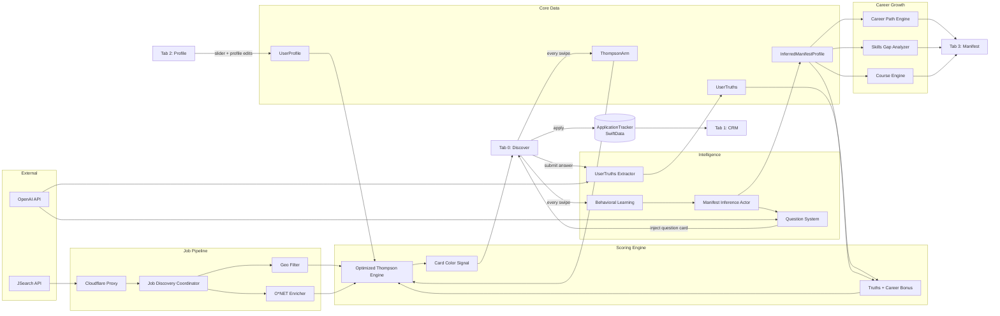

# Overall Systems — Manifest & Match v1.1

Renders on GitHub, in VS Code (Markdown Preview Mermaid Support), or paste into mermaid.live

## Key Architectural Truths

- Every swipe does two things simultaneously: updates `ThompsonArm` (future scoring) AND feeds `ManifestInferenceActor` (behavioral learning)
- `InferredManifestProfile` is both a scoring input (career bonus) AND the data source for the entire Manifest tab
- `OTE` = Optimized Thompson Engine — the single scoring instance, sync init, Core Data persistence
- The Question System is a closed loop: intelligence detects data gaps → injects question card → answer trains intelligence
- `ApplicationTracker` uses SwiftData (not Core Data) — it is self-contained and feeds only Tab 1
- The slider lives in Tab 2 (Profile), not Tab 0. Its value propagates to scoring at next deck load.
