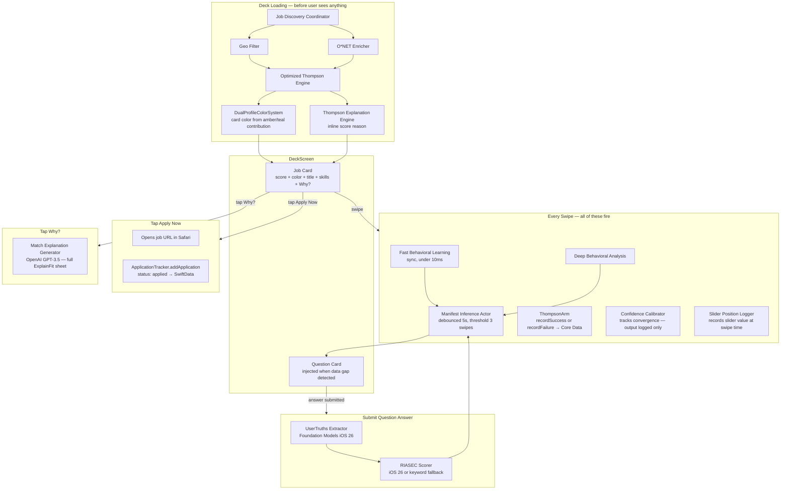

# Tab 0: Discover

The main swipe deck. Every interaction here either updates the scoring model or trains the intelligence layer.

## What Has No UI Home (fires but user never sees it)

| System | Fires when | Output goes nowhere |
|---|---|---|
| ConfidenceCalibrator | Every swipe | Convergence data logged, never displayed |
| SliderPositionLogger | Every swipe | A/B analytics data, no display path yet |
| DeepBehavioralAnalysis | Every swipe | Feeds MIA only, no direct UI output |
