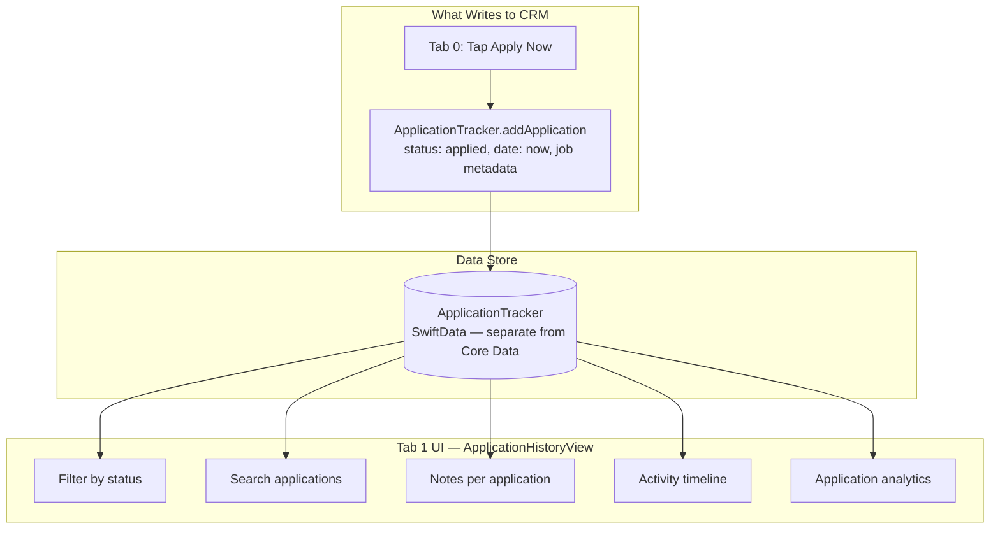

# Tab 1: CRM (Application Tracker)

Tracks job applications. Fed entirely by the apply action in Tab 0. User manages their active job pipeline here.

## Status in v1.1

- Data store: working (SwiftData, self-contained)
- UI: working (ApplicationHistoryView)
- Apply action write: **was disconnected in V7/V8 — wired correctly in v1.1**

## Gaps

- No push notifications for status changes
- Status updates (applied → interview → offer → rejected) are manual only — no external data source
- No connection to scoring engine — applying to a job doesn't currently change how the deck scores similar jobs
