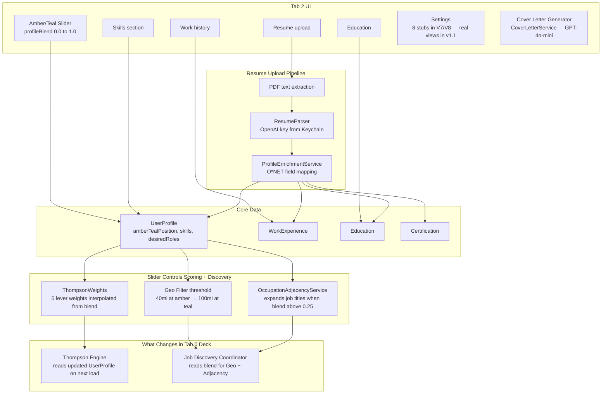

# Tab 2: Profile

User settings and data management. The slider lives here. Changes here propagate directly into scoring at next deck load.

## Key Fact: Slider Lives in Tab 2, Not Tab 0

The slider is in ProfileScreen (Tab 2). Its value persists to `UserProfile.amberTealPosition` in Core Data. DeckScreen reads it at init. Changing the slider does not instantly re-sort the current deck — it takes effect on the next job fetch.

## Gaps

- 8 settings links are stubs in V7/V8 — need real views: Change Password, Privacy Settings, Data Management, etc.
- No Keychain UI — users have no way to enter/update their OpenAI key from Settings
- Slider change does not trigger immediate deck refresh — user must navigate away and back
