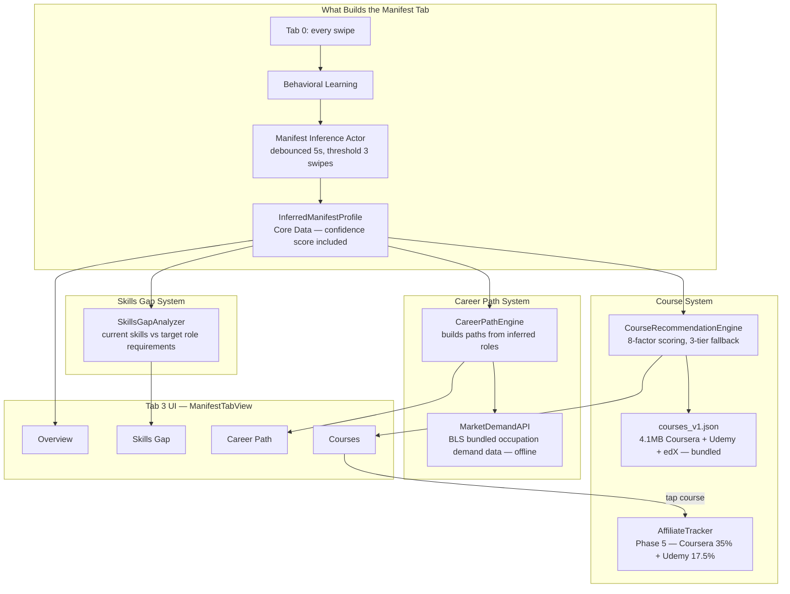

# Tab 3: Manifest

Career building hub. Everything here is driven by `InferredManifestProfile` — the model built entirely from swipe behavior in Tab 0. A new user with zero swipes sees nothing meaningful here. This is by design.

## Key Fact: Manifest Tab Is Entirely Inference-Driven

No job listing data reaches this tab. No external APIs are called here (MarketDemandAPI uses bundled offline BLS data). Everything is derived from the user's own swipe behavior. The richer the swipe history, the more meaningful this tab becomes.

## What Was Broken in V7/V8 — Fixed in v1.1

| System | V7/V8 State | v1.1 |
|---|---|---|
| CourseRecommendationEngine | Never called, courses tab empty, filename crash bug | Wired, filename fixed |
| CareerPathEngine | Never called, ManifestTabView built paths ad-hoc | Routed through CareerPathEngine |
| SkillsGapAnalyzer | Marked ISSUE #2 in ManifestTabView — incomplete wiring | Wired |

## Gaps

- No empty state design for new users (fewer than 3 swipes)
- AffiliateTracker requires real credentials (Phase 5) — placeholder until then
- edX has no affiliate program (0% commission) — lower implementation priority
- TealPathGenerator (future career projections) exists but not shown in current tab destinations
