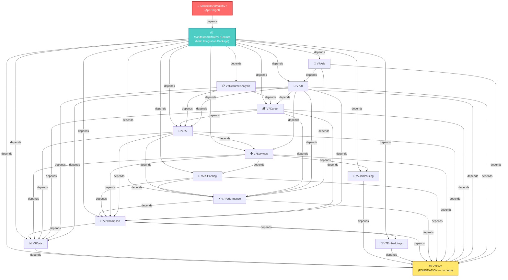

# SCHEMATIC 01 — Package Dependencies
**Manifest & Match V8 | Generated: 2026-05-14**

---

## Dependency Graph

---

## Build Order (must compile in this sequence)

| Order | Package | Level | Reason |
|---|---|---|---|
| 1 | **V7Core** | 0 — Foundation | No dependencies. Sacred constants, base types, SacredUI. |
| 2 | **V7Data** | 1 | Core Data entities. Only needs V7Core. |
| 3 | **V7JobParsing** | 1 | Job description parsing. Only needs V7Core. |
| 4 | **V7Embeddings** | 1 | Vector embeddings. Only needs V7Core. (disabled in prod) |
| 5 | **V7Thompson** | 2 | Scoring engine. Needs V7Core + V7Data + V7Embeddings. |
| 6 | **V7Performance** | 2 | Monitoring. Needs V7Core + V7Thompson. |
| 7 | **V7AIParsing** | 3 | AI parsing. Needs V7Core + V7Thompson + V7Performance. |
| 8 | **V7Services** | 3 | Job sources + coordinator. Needs V7Core + V7Thompson + V7JobParsing + V7AIParsing + V7Data. |
| 9 | **V7AI** | 4 | Question generation, behavioral learning. Needs V7Core + V7Data + V7Services + V7Thompson + V7Performance. |
| 10 | **V7Career** | 5 | Career path building. Needs V7Core + V7Data + V7Thompson + V7AI + V7Performance. |
| 11 | **V7ResumeAnalysis** | 5 | Resume parsing. Needs V7Core + V7Data + V7Career + V7AI. |
| 12 | **V7UI** | 6 | All SwiftUI views. Needs V7Core + V7Services + V7Thompson + V7Performance + V7AI + V7Data + V7Career. |
| 13 | **V7Ads** | 6 | Ad cards (inactive). Needs V7Core + V7UI + V7Performance. |
| 14 | **ManifestAndMatchV7Feature** | 7 | Main integration package. Depends on all 13 above. |
| 15 | **ManifestAndMatchV7** | 8 | App target. Depends on Feature package. |

---

## Package Summary Table

| Package | Exposed Product | Direct Dependencies | Notes |
|---|---|---|---|
| V7Core | `V7Core` | *none* | Foundation. SacredUI constants. Never change without reason. |
| V7Data | `V7Data` | V7Core | 15 Core Data entities. Single source of truth for persistence. |
| V7JobParsing | `V7JobParsing` | V7Core | Extracts skills from job descriptions using NLP. |
| V7Embeddings | `V7Embeddings` | V7Core | Semantic vector embeddings. Disabled by default in prod. |
| V7Thompson | `V7Thompson` | V7Core, V7Data, V7Embeddings | Scoring engine. FastBetaSampler. ThompsonCache. |
| V7Performance | `V7Performance` | V7Core, V7Thompson | <10ms monitoring. DEBUG dashboard. |
| V7AIParsing | `V7AIParsing` | V7Core, V7Thompson, V7Performance | AI-powered job + resume parsing. |
| V7Services | `V7Services` | V7Core, V7Thompson, V7JobParsing, V7AIParsing, V7Data | Job source APIs. JobDiscoveryCoordinator. Only JSearch active. |
| V7AI | `V7AI` | V7Core, V7Data, V7Services, V7Thompson, V7Performance | Question generation. Behavioral learning. RIASEC mapping. |
| V7Career | `V7Career` | V7Core, V7Data, V7Thompson, V7AI, V7Performance | Career paths. Manifest tab. Skill gap analysis. |
| V7ResumeAnalysis | `V7ResumeAnalysis` | V7Core, V7Data, V7Career, V7AI | Resume PDF parsing. Optional in onboarding. |
| V7UI | `V7UI` | V7Core, V7Services, V7Thompson, V7Performance, V7AI, V7Data, V7Career | All SwiftUI views. DeckScreen (3353 lines). Terminal package. |
| V7Ads | `V7Ads` | V7Core, V7UI, V7Performance | Ad card integration. Inactive. |
| ManifestAndMatchV7Feature | `ManifestAndMatchV7Feature` | All 13 above | Onboarding, MainTabView, ContentView, AI screens. |
| ManifestAndMatchV7 | App target | ManifestAndMatchV7Feature | Entry point. Assets. Info.plist. |

---

## Resolved Circular Dependencies

All circular deps were previously resolved. Evidence in Package.swift comments:

| Risk | Resolution | Package.swift note |
|---|---|---|
| V7Services ↔ V7Performance | V7Services removed V7Performance dep | "Removed V7Performance dependency to eliminate circular dependency" |
| V7Services ↔ V7Career | V7Services removed V7Career dep | "Removed V7Career dependency to eliminate circular dependency" |
| V7Career ↔ V7Services | V7Career removed V7Services dep | "V7Services removed: Circular dependency (V7Services → V7Career → V7AI → V7Services)" |
| V7Career ↔ V7UI | V7Career removed V7UI dep | "V7UI removed: Circular dependency (V7UI is terminal package)" |

**Current state: 0 circular dependencies. True DAG.**

---

## Notes

- V7UI has the highest fan-in (7 direct deps) — intentional, it is the terminal presentation layer
- V7Ads sits above V7UI — any V7UI change affects V7Ads build
- ChartsColorTestPackage exists at root level as an isolated test utility with no dependencies
- No external third-party SPM dependencies — all system frameworks only (Charts, NaturalLanguage, CoreML, Foundation Models)
