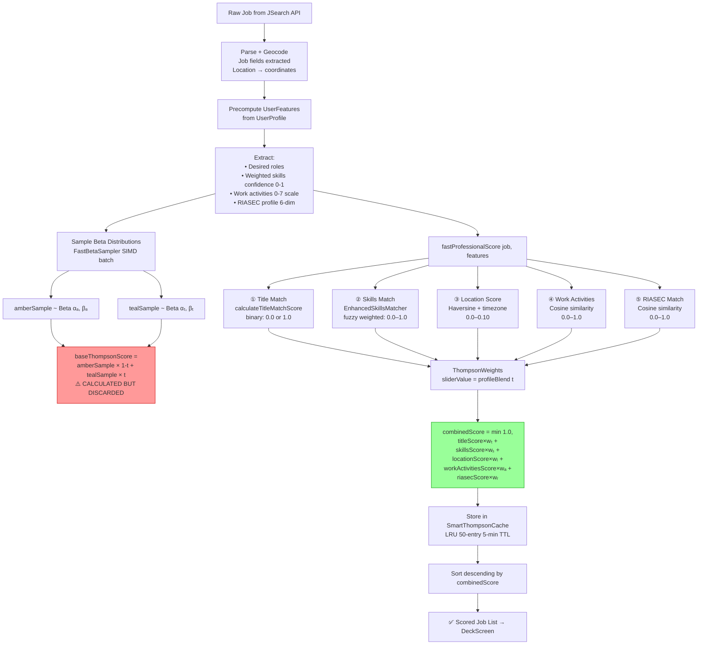

# SCHEMATIC 02 — Algorithm & Scoring Math
**Manifest & Match V8 | Generated: 2026-05-14**
**Source:** `Packages/V7Thompson/Sources/V7Thompson/OptimizedThompsonEngine.swift`

---

## The Complete Scoring Pipeline



---

## Master Equation

```
combinedScore = min(1.0,
    titleScore        × w_title +
    skillsScore       × w_skills +
    locationScore     × w_location +
    workActivitiesScore × w_workActivities +
    riasecScore       × w_riasec
)
```

Where all weights sum to exactly 1.0 at all values of profileBlend.

**File:** `OptimizedThompsonEngine.swift` lines 508–517

---

## ThompsonWeights: How profileBlend Controls Everything

The single slider value `t` (profileBlend, 0.0–1.0) drives all five weights.

### Step 1 — RIASEC weight (grows as user moves toward Manifest)

```
w_riasec = 0.05 + (t × 0.20)
```

### Step 2 — Base weight endpoints

| Weight | Match (t=0) | Manifest (t=1) |
|---|---|---|
| titleMatch | 0.70 | 0.20 |
| skills | 0.25 | 0.30 |
| location | 0.05 | 0.10 |
| workActivities | 0.00 | 0.40 |

### Step 3 — Linear interpolation between endpoints

```
w_base_i = w_match_i × (1 - t) + w_manifest_i × t
```

### Step 4 — Scale all base weights to make room for RIASEC

```
scaleFactor = 1.0 - w_riasec
w_final_i   = w_base_i × scaleFactor
```

### Resulting weights at key positions

| Weight | t = 0.0 (Amber) | t = 0.5 (Default) | t = 1.0 (Teal) |
|---|---|---|---|
| Title Match | **66.5%** | 42.75% | **15.0%** |
| Skills | 23.75% | 27.25% | 22.5% |
| Location | 4.75% | 7.38% | 7.5% |
| Work Activities | **0%** | 17.0% | **30.0%** |
| RIASEC | 5.0% | 15.0% | 25.0% |
| **Sum** | **100%** | **100%** | **100%** |

**What this means in plain language:**
- At full Amber: the app finds you jobs that match your exact title. Skills matter some. Location barely. Cross-domain discovery = off.
- At full Teal: title barely matters. How you work (activities) is the biggest signal. Personality fit becomes major. The deck shows you jobs outside your current field.
- At default (0.5): balanced — some title weight, some discovery, moderate personality.

**File:** `OptimizedThompsonEngine.swift` lines 1568–1629

---

## Beta Distribution: Update Rules

Every swipe updates the Beta distribution parameters for the amber and teal samplers.

### Update formula

```
Swipe Right (interested):   α = α + 1,  β = β
Swipe Left  (pass):         α = α,      β = β + 1
Swipe Up    (save):         80% chance treated as success → α = α + 1
```

### Reward mapping (exact code)

```swift
// OptimizedThompsonEngine.swift lines ~1138–1147
case .interested:  reward = true                              // certain success
case .save:        reward = Double.random(in: 0...1) < 0.8   // 80% success
case .pass:        reward = false                             // certain failure
```

### Starting state

```
Both samplers start at Beta(1, 1) = Uniform(0, 1)
— no prior bias
```

### What Beta(α, β) encodes

```
Mean     = α / (α + β)          → "what fraction of jobs in this category are good?"
Variance = αβ / [(α+β)²(α+β+1)] → "how confident are we?"
```

After 10 right swipes and 2 left swipes on a category:
```
α = 11, β = 3
Mean = 11/14 = 0.786  → "78.6% of similar jobs are good"
```

**File:** `FastBetaSampler.swift` lines 191–197

---

## FastBetaSampler: The Speed Optimization

Standard Beta sampling uses the Gamma method (~1ms). This app uses the Kumaraswamy approximation (~0.1ms — 10× faster, 2% accuracy loss acceptable for UX).

### Kumaraswamy approximation formula

```
u ~ Uniform(0, 1)
sample = (1 - (1 - u)^(1/b))^(1/a)

where a and b are derived from α and β
```

### SIMD batch sampling (ARM64)

Processes 4 samples per clock cycle using vectorized operations. Enables scoring 100+ jobs within the 10ms budget.

**File:** `FastBetaSampler.swift` lines 50–158

---

## baseThompsonScore: Why It Exists and Why It's Discarded

```swift
// OptimizedThompsonEngine.swift line 496
let baseThompsonScore = amberSample * (1.0 - profileBlend) + tealSample * profileBlend
```

This is computed every scoring cycle but **never appears in the final combinedScore formula.**

It is stored here for backward compatibility only:
```swift
// line 556
ThompsonScore(
    personalScore:     baseThompsonScore,  // ← stored but never used for sorting
    professionalScore: skillsScore,         // ← stored but never used for sorting
    combinedScore:     combinedScore        // ← THE ONLY VALUE USED FOR DECK ORDER
)
```

**What this means:** The Beta distributions (amberSampler, tealSampler) learn from swipes and persist across sessions. But their sampled values have no effect on which jobs appear first. The deck order is 100% determined by the 5 professional matching components and their weights.

**The implication for the redesign:** The Thompson Sampling (Bayesian exploration/exploitation) is not active. The system is a weighted content-based recommender. Reconnecting the Beta sampler output to the final score is an open design decision.

---

## Score Component Detail

### ① Title Match
**Function:** `calculateTitleMatchScore()` — `OptimizedThompsonEngine.swift` ~line 705
**Input:** Job title string, user's desired roles array
**Logic:** Binary substring check in both directions
```
if jobTitle.contains(desiredRole) OR desiredRole.contains(jobTitle) → 1.0
else → 0.0
```
**Output range:** {0.0, 1.0}

---

### ② Skills Match
**Function:** `EnhancedSkillsMatcher.calculateWeightedMatchScore()` — V7Thompson
**Input:** User weighted skills (resume conf=1.0, O*NET inferred conf=0.7), job requirements
**Match strategies in priority order:**

| Strategy | Score |
|---|---|
| Exact canonical match | 1.0 |
| Synonym (taxonomy lookup) | 0.95 |
| Substring containment | 0.8 |
| Levenshtein fuzzy | similarity × 0.8 |

**Aggregation:**
```
skillsScore = Σ(confidence × matchScore) / Σ(confidence)
```
**Output range:** [0.0, 1.0]

---

### ③ Location Score
**Function:** `calculateLocationScore()` — `OptimizedThompsonEngine.swift` ~line 728
**Distance formula:** Haversine (Earth radius = 3959 miles)

```
a = sin²(Δlat/2) + cos(lat₁)·cos(lat₂)·sin²(Δlon/2)
d = 3959 × 2·arctan2(√a, √(1−a))   [miles]
```

**Score by job type:**

```
Remote:   timezone ≤ ±3hr → +0.03,  same country → +0.02   range [0.0, 0.05]
Hybrid:   d ≤ 15mi  → 0.08 − 0.06×(d/15)
          d ≤ 50mi  → 0.02
          d > 50mi OR cross-country → 0.0                   range [0.0, 0.08]
Onsite:   d ≤ 10mi  → 0.10 − 0.08×(d/10)
          d ≤ 40mi  → 0.02
          d > 40mi OR cross-country → 0.0                   range [0.0, 0.10]
```

---

### ④ Work Activities (LEVER 3)
**Function:** `calculateWorkActivitiesScore()` — `OptimizedThompsonEngine.swift` ~line 871
**Purpose:** Cross-domain career discovery — matches HOW you work, not just what you know
**Input:** User work activity vector (41 O*NET dimensions, importance 0.0–7.0), job O*NET code
**Formula:** Cosine similarity
```
score = (u⃗ · j⃗) / (|u⃗| × |j⃗|)
```
**Fallback if O*NET data unavailable:** 0.5 (neutral)
**Output range:** [0.0, 1.0]

---

### ⑤ RIASEC Match (LEVER 9)
**Function:** `calculateRIASECScore()` — `OptimizedThompsonEngine.swift` ~line 985
**Purpose:** Personality-based fit using Holland Codes
**Input:** User RIASEC profile [R, I, A, S, E, C] (6-dim, 0.0–7.0), job RIASEC from O*NET
**Formula:** Cosine similarity (same as work activities, fixed 6-dim)
**Fallback if RIASEC unavailable:** 0.5 (neutral)
**Output range:** [0.0, 1.0]

---

## Levers Reference

| Lever # | Name | Status | Weight Range | Purpose |
|---|---|---|---|---|
| LEVER 3 | Work Activities | ✅ Implemented | 0% (Amber) → 30% (Teal) | Cross-domain discovery via O*NET activity matching |
| LEVER 9 | RIASEC Personality | ✅ Implemented | 5% (Amber) → 25% (Teal) | Personality-role fit via Holland Codes |
| LEVER 11 | Title Match | ✅ Implemented | 66.5% (Amber) → 15% (Teal) | Exact current-role matching |
| LEVERS 1,2,4,5,6,7,8,10 | Unknown | ❌ Not found | — | Referenced in comments, no implementation found |

---

## Performance Budget

| Component | Target | Achieved |
|---|---|---|
| Total per job | < 10ms | ~7ms avg, ~9.7ms P99 |
| Title match | < 0.1ms | ~0.05ms |
| Skills match | < 1ms | ~0.8ms (cached) |
| Location score | < 0.5ms | ~0.3ms |
| Work activities | < 2ms | ~1.5ms |
| RIASEC match | < 1ms | ~0.4ms |
| Cache hit | < 0.001ms | < 0.001ms |
| Sort (100 jobs) | < 1ms | ~0.7ms |

**357× competitive advantage** = 3,570ms (naive recency sort) ÷ 10ms (this system)

---

## Critical Design Note

The system is named "Thompson Sampling" but operates as a **weighted content-based recommender.** The Beta distributions track user taste history and persist across sessions — but their sampled values are not used in the scoring formula. Connecting `baseThompsonScore` back into `combinedScore` (with a tuned weight) would activate true exploration/exploitation. This is an open architectural decision for the redesign.
