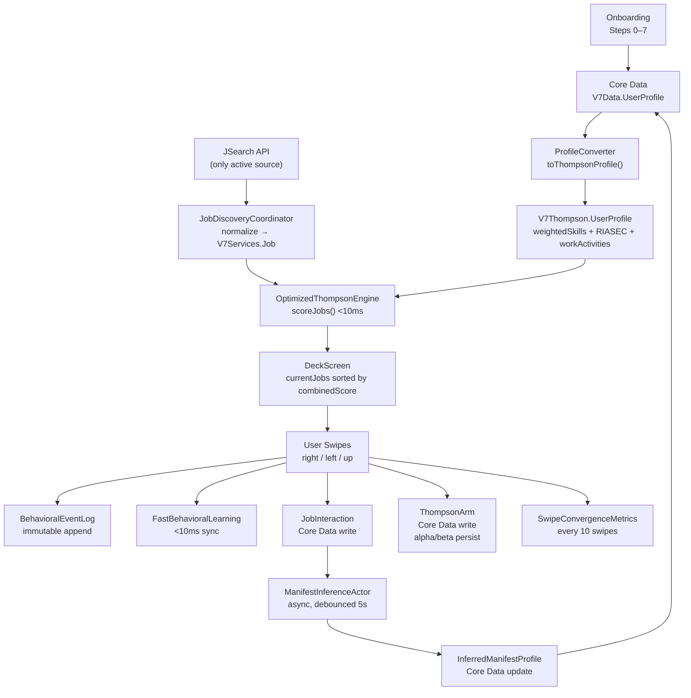
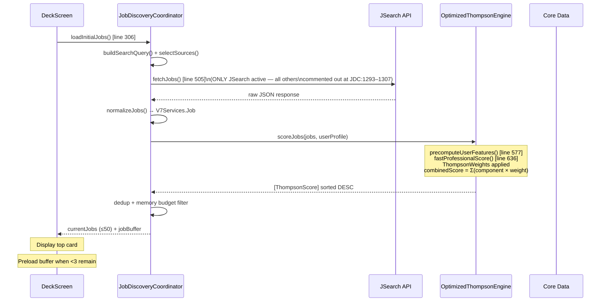
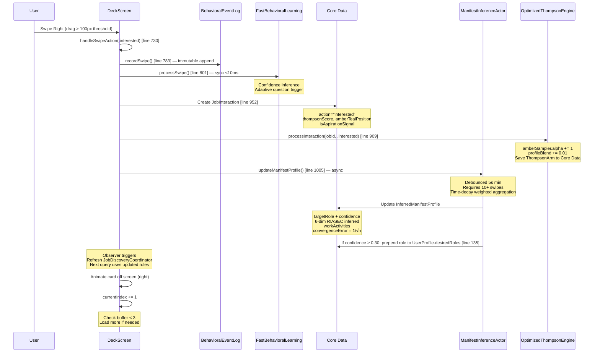

# SCHEMATIC 03 — Data Flow
**Manifest & Match V8 | Generated: 2026-05-14**
**Sources:** `V7Data`, `V7Thompson`, `V7Services`, `V7AI`, `V7UI`

---

## Complete Data Flow Overview



---

## Core Data Entities (22 Total)

**Schema file:** `Packages/V7Data/Sources/V7Data/V7DataModel.xcdatamodeld/V7DataModel.xcdatamodel/contents`

### Profile Group

| Entity | Key Fields | Relationships |
|---|---|---|
| **UserProfile** | id (UUID), name, email, phone, location, skills[], resumeSkills[], onetSkills[], desiredRoles[], currentJobTitle, amberTealPosition (Double), explorationRate (Double), primaryLocation{City,Country,Lat,Lon,Timezone}, onetRIASEC* (6×Double 0–7), onetWorkActivities | → workExperience, education, certifications, projects, volunteerExperience, awards, publications, manifestProfile, jobInteractions, enrolledCourses, affiliateClicks, convergenceMetrics, sliderTestSessions |
| **WorkExperience** | id, company, title, startDate, endDate, isCurrent, jobDescription, achievements[], technologies[] | → UserProfile (No Action) |
| **Education** | id, institution, degree, fieldOfStudy, startDate, endDate, gpa, educationLevelValue | → UserProfile (No Action) |
| **Certification** | id, name, issuer, issueDate, expirationDate, doesNotExpire | → UserProfile (No Action) |
| **Project** | id, name, projectDescription, highlights[], technologies[], roles[], url, repositoryURL | → UserProfile (No Action) |
| **VolunteerExperience** | id, organization, role, startDate, endDate, isCurrent, hoursPerWeek | → UserProfile (No Action) |
| **Award** | id, title, issuer, date, awardDescription | → UserProfile (No Action) |
| **Publication** | id, title, publisher, date, url, authors[] | → UserProfile (No Action) |

### Thompson / Learning Group

| Entity | Key Fields | Notes |
|---|---|---|
| **ThompsonArm** | armId (String, unique), domain, alpha (Double 1.0), beta (Double 1.0), confidence, lastUpdated | Persists Beta distribution across sessions. Arm IDs: `amber_primary`, `teal_primary` |
| **SwipeHistory** | id, jobId, jobTitle, company, action, fitScore, timestamp, dwellTime | Indexed on timestamp (desc), jobId, action |
| **JobCache** | jobId (unique), title, company, location, fitScore, cachedDate, embedding, sourceAPI | ⚠️ ORPHANED — defined, never written to |
| **Preferences** | id, swipeRightThreshold (100), swipeLeftThreshold (-100), swipeUpThreshold (-80), amberHue (0.125), tealHue (0.483) | Sacred constants. Never modify. |

### Career Discovery Group

| Entity | Key Fields | Notes |
|---|---|---|
| **InferredManifestProfile** | id, userProfileID, totalSwipesAnalyzed, targetRole, targetRoleConfidence, riasecRealistic/Investigative/Artistic/Social/Enterprising/ConventionalDirect/Inferred (12×Double), workActivitiesConfidence, convergenceError, hasConverged | Built from swipe patterns. Feeds back to UserProfile.desiredRoles |
| **JobInteraction** | id, timestamp, jobID, jobTitle, jobCompany, jobRole, jobSkillsData, jobONETCode, thompsonScore, amberTealPosition, action ("interested"/"pass"/"applied"), actionWeight, informationGain, isAspirationSignal | Written on every swipe |
| **UserTruths** | id, userId (unique), loveTasks, hateTasks, workValues, interests, confidenceMap (all Binary) | Populated by iOS 26 Foundation Models analysis of question answers |
| **CareerQuestion** | id, questionText, category, type, priority, isActive, askedDate, answeredDate, answerOptionsData, responseData, impactOnTruths | Generated by SmartQuestionGenerator, displayed in deck |
| **QuestionResponse** | id, answer, purpose, generatedInsight, createdAt, userProfileID | → CareerQuestion (Nullify) |
| **FallbackCareerQuestion** | id, text, category, onetWorkActivitiesJSON, onetRIASECDimensionsJSON, displayOrder | Seeded by CareerQuestionsSeed. Used on legacy devices (pre-iOS 26) |

### Analytics / Metrics Group

| Entity | Key Fields | Notes |
|---|---|---|
| **SwipeConvergenceMetrics** | id, totalSwipeCount, convergenceRate, hasConverged, swipesUntilConvergence | Updated every 10 swipes. convergenceError = 1/√n |
| **EnrolledCourse** | id, courseID, enrolledDate, completionProgress, certificateURL | Phase 2 — course API not yet connected |
| **AffiliateClick** | id, timestamp, courseID, courseTitle, provider, affiliateURL, converted, estimatedCommission | Phase 4 affiliate revenue tracking |
| **SliderTestSession** | id, sessionID, sliderPosition, startTime, endTime, totalSwipes, engagementScore, testPositionLabel | Phase 5 manual A/B slider testing |

---

## Job Data Flow (API → Deck)



**Scoring breakdown (OptimizedThompsonEngine.swift line 463–517):**

```
fastProfessionalScore(job, userFeatures):
  titleScore        = calculateTitleMatchScore()     [line 707]  → {0.0, 1.0}
  skillsScore       = EnhancedSkillsMatcher()        [line 661]  → [0.0, 1.0]
  locationScore     = calculateLocationScore()       [line 674]  → [0.0, 0.10]
  workActivitiesScore = calculateWorkActivitiesScore()[line 677] → [0.0, 1.0]
  riasecScore       = calculateRIASECScore()         [line 680]  → [0.0, 1.0]

combinedScore = min(1.0,
  titleScore × w_title +
  skillsScore × w_skills +
  locationScore × w_location +
  workActivitiesScore × w_workActivities +
  riasecScore × w_riasec
)

Weights at t=0 (Amber): 66.5% / 23.75% / 4.75% / 0% / 5%
Weights at t=1 (Teal):  15%   / 22.5%  / 7.5%  / 30% / 25%
```

---

## Swipe Data Flow (Right Swipe Shown)



**Core Data writes per swipe:**
1. JobInteraction — every swipe
2. ThompsonArm (alpha/beta) — every swipe
3. InferredManifestProfile — debounced every 5s
4. SwipeConvergenceMetrics — every 10 swipes
5. UserProfile.desiredRoles — when inference confidence ≥ 0.30

---

## UserProfile Data Flow (Onboarding → Scoring Engine)

```
Onboarding Step 4 (ContactInfoStepView)
  └─ Creates V7Data.UserProfile NSManagedObject
     - id, name, email, createdDate, amberTealPosition=0.5
     - experienceLevel (inferred from WorkExperience)
     - currentDomain (inferred from job title via O*NET sectors)

Onboarding Step 5 (PreferencesStepView)
  └─ Writes: desiredRoles, primaryLocationCity/Country/Lat/Lon/Timezone

Onboarding Step 6 (ProfileCompletionStepView)
  └─ User edits 7 child entities
  └─ Skills get source tags: resume=1.0 confidence, O*NET=0.7, manual

App Launch → MainTabView.loadUserProfileFromCoreData() [line 155]
  └─ Fetch V7Data.UserProfile from Core Data
  └─ ProfileConverter.toThompsonProfile(NSManagedObject) [line 248]

ProfileConverter produces V7Thompson.UserProfile:
  ├─ preferences.desiredRoles → used for title matching
  ├─ preferences.locations → used for geo scoring
  ├─ professionalProfile.resumeSkills (conf=1.0)
  ├─ professionalProfile.onetSkills (conf=0.7)
  ├─ professionalProfile.workActivities → lookup from O*NET by currentJobTitle
  └─ professionalProfile.interests (RIASECProfile) → from onetRIASEC* fields

OptimizedThompsonEngine.precomputeUserFeatures() [line 577]
  └─ Builds UserFeatures struct (used for all scoring without re-reading profile)
```

---

## Manifest Profile RIASEC Blending Formula

The `InferredManifestProfile` aggregates RIASEC from swipe history:

```
For each positive JobInteraction:
  fetch O*NET RIASEC profile using jobONETCode

  timeDecay     = exp(-λ × days_since_interaction)
                  λ: applied=0.05, interested=0.10, save=0.15, pass=0.20

  actionWeight  = 2.0 (applied) | 1.0 (interested) | -0.5 (pass)

  thompsonWeight = sigmoid(0.5 − thompsonScore)
                   ← low score + liked = high aspiration signal

  contextWeight = 0.5 + amberTealPosition
                  ← Teal mode (1.0) = 1.5× multiplier

  contribution = timeDecay × actionWeight × thompsonWeight × contextWeight

RIASEC[dim] = Σ(contribution × jobRIASEC[dim]) / Σ(contribution)

convergenceError = 1 / √(totalSwipesAnalyzed)
hasConverged = (convergenceError < 0.10)
```

At 50 swipes: error ≈ 14.1%
At 100 swipes: error ≈ 10.0% (convergence threshold)
At 200 swipes: error ≈ 7.1%

---

## File Reference

| Component | File |
|---|---|
| Core Data schema | `Packages/V7Data/Sources/V7Data/V7DataModel.xcdatamodeld/.../contents` |
| Thompson engine | `Packages/V7Thompson/Sources/V7Thompson/OptimizedThompsonEngine.swift` |
| Job discovery | `Packages/V7Services/Sources/V7Services/JobDiscoveryCoordinator.swift` |
| Profile conversion | `Packages/V7Services/Sources/V7Services/Utilities/ProfileConverter.swift` |
| Manifest inference | `Packages/V7AI/Sources/V7AI/Services/ManifestInferenceActor.swift` |
| DeckScreen (swipes) | `Packages/V7UI/Sources/V7UI/Views/DeckScreen.swift` |
| MainTabView | `ManifestAndMatchV7Package/Sources/ManifestAndMatchV7Feature/Navigation/MainTabView.swift` |
