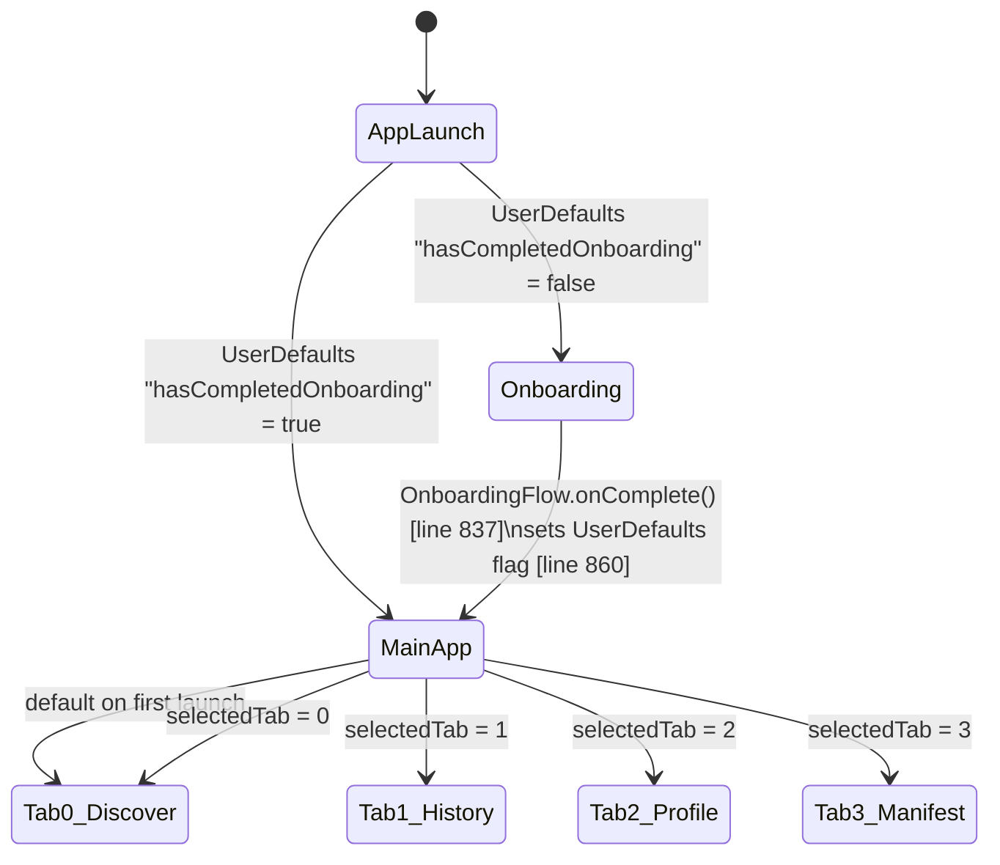
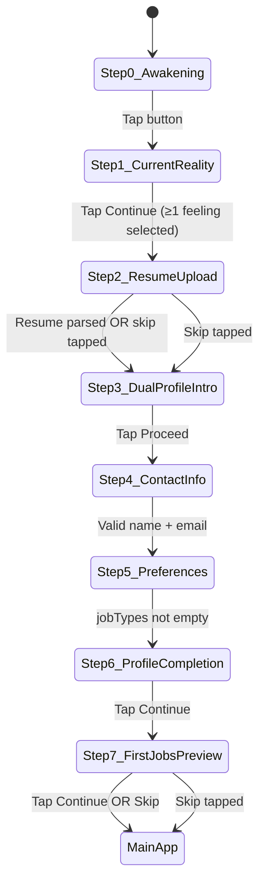

# SCHEMATIC 04 — User Flow
**Manifest & Match V8 | Generated: 2026-05-14**
**Sources:** `ManifestAndMatchV7Feature/Onboarding/`, `V7UI/Views/`, `V7Career/Views/`

---

## Top-Level State Machine



**Gate:** `MainTabView.swift:24` — `showOnboarding: Bool = !UserDefaults.standard.bool(forKey: "hasCompletedOnboarding")`

---

## Onboarding Flow (8 Steps)

**Container:** `OnboardingFlow.swift:132`
**Path:** `ManifestAndMatchV7Package/Sources/ManifestAndMatchV7Feature/Onboarding/`

| Step | Index | View | Data Collected | Core Data Written | Skippable | Notes |
|---|---|---|---|---|---|---|
| Awakening | 0 | `AwakeningStepView.swift` | Resonance statement selection ("successful not satisfied", "wonder what else", "work that energizes me") | None | ✅ Auto-advances on button tap | No validation. Narrative opening. |
| Current Reality | 1 | `CurrentRealityStepView.swift` | Emotional state (6 feelings: Stuck, Curious, Burned Out, Ready for More, Uncertain, Ambitious) | None | ✅ Optional selection | Multi-select. Continue disabled until ≥1 selected. |
| Resume Upload | 2 | `ResumeUploadStepView.swift` | PDF resume → parsed skills, work history, education | WorkExperience, Education, Certification (child entities from ParsedResume) | ✅ Skip button | V7AIParsing.ResumeParser. Auto-advances with 2-second delay. |
| Dual Profile Intro | 3 | `DualProfileIntroStepView.swift` | None (visual explanation of Amber/Teal system) | None | ✅ Proceed after viewing | Moved earlier in Phase 1 for narrative flow. |
| Contact Info | 4 | `ContactInfoStepView.swift:55` | Name, email, phone, location, LinkedIn, GitHub, professional summary | **V7Data.UserProfile — PRIMARY CREATE** (id, name, email, amberTealPosition=0.5, experienceLevel, currentDomain inferred) | ❌ Required | Validation: name ≥2 chars, valid email. Auto-fills from ParsedResume. |
| Preferences | 5 | `PreferencesStepView.swift:15` | Job types, salary range, remote preference, desired locations, job titles, company size, career timeline, risk tolerance, exploration rate | UserProfile.desiredRoles, UserProfile.primaryLocation{City/Country/Lat/Lon/Timezone} | ❌ Required | Validation: jobTypes not empty. Initializes Thompson params. |
| Profile Completion | 6 | `ProfileCompletionStepView.swift:82` | Review/edit all parsed resume data across 8 sections | WorkExperience, Education, Certification, Project, VolunteerExperience, Award, Publication | ❌ Required | Skills display source badges: blue=resume, purple=O*NET inferred, green=manual. |
| First Jobs Preview | 7 | `FirstJobsPreviewStepView.swift` | None (demo cards with mock Thompson scores: 87%, 72%, 91%) | None | ✅ Skip to main app | Teaches swipe gestures. `onNext()` completes onboarding. |

**Completion sequence (OnboardingFlow.swift:791–860):**
```
1. ProfileManager.shared.updateProfile(userProfile)       [line 807]
2. Call onComplete() callback → MainTabView               [line 837]
3. UserDefaults.set(true, "hasCompletedOnboarding")       [line 860]
4. UserDefaults.set(Date(), "onboardingCompletionDate")   [line 861]
5. UserDefaults.set(skip, "v7.onboardingSkipped")         [line 862]
```

---

## Onboarding State Transitions



---

## Tab Architecture

**Root view:** `MainTabView.swift:20`
**Tab enum:** `V7Career.V7Tab` defined in `TabCoordinator.swift:18`
**Selected tab persisted:** `UserDefaults "v7.phase3.selectedTab"` (TabCoordinator:127–150)

### Tab 0 — Discover

**Root view:** `DeckScreen.swift:92`

```
DeckScreen
├─ jobDiscoveryView()       — main deck (job cards + question cards)
├─ Sheet 1: JobDetailsSheet — full job detail (line 292–298)
├─ Sheet 2: ExplainFitSheet — Thompson score explanation (line 301–307)
│  └─ Powered by ScoreDecomposition + ThompsonExplanationEngine
└─ Sheet 3: MLInsightsDashboard — ML insights (line 309–318)
```

**Card types in deck:**
- `CardItem.job(JobItem)` — standard job card
- `CardItem.question(CareerQuestion)` — RIASEC question card (injected every ~5 jobs)

### Tab 1 — History

**Root view:** `HistoryScreen.swift:7` → wraps `ApplicationHistoryView`

```
HistoryScreen
└─ ApplicationHistoryView
   ├─ Filter: All / Active / Archived / Favorites
   ├─ Search bar
   ├─ Per-application notes
   └─ Activity log (timeline of interactions per job)
```

### Tab 2 — Profile

**Root view:** `ProfileScreen.swift:44`

```
ProfileScreen
├─ Sections:
│  ├─ Header: Name, initials
│  ├─ Current→Future blend slider (profileBlend / amberTealPosition)
│  ├─ Skills (add manually or re-upload resume)
│  ├─ Years experience + salary range sliders
│  ├─ Work experience (collapsible, add/edit)
│  ├─ Education (collapsible)
│  ├─ Certifications
│  └─ Remote preference (onsite/remote/hybrid)
│
├─ Sheets (15 total):
│  ├─ Resume Upload
│  ├─ Work Experience add/edit
│  ├─ Education add/edit
│  ├─ Certification add/edit
│  ├─ Project add/edit
│  ├─ Volunteer add/edit
│  ├─ Award add/edit
│  ├─ Publication add/edit
│  ├─ Cover Letter Generator
│  ├─ Resume Generator
│  └─ Settings
│
└─ NavigationLink destinations (ALL STUBS — Text() placeholders):
   ├─ Change Password           ← Text("Change Password")
   ├─ Privacy Settings          ← Text("Privacy Settings")
   ├─ Data Management           ← Text("Data Management")
   ├─ Help Center               ← Text("Help Center")
   ├─ Contact Support           ← Text("Contact Support")
   ├─ FAQ                       ← Text("FAQ")
   ├─ Terms of Service          ← Text("Terms of Service")
   └─ Privacy Policy            ← Text("Privacy Policy")
```

### Tab 3 — Manifest

**Root view:** `ManifestTabView.swift:38`

```
ManifestTabView
├─ Sheet: Manifest onboarding (first-time, line 147–149)
│  └─ Gate: UserDefaults "v7.phase3.hasSeenManifestOnboarding"
│
└─ NavigationDestination (ManifestDestination enum, TabCoordinator.swift:18):
   ├─ overview          — career summary card
   ├─ skillsGap         — skills gap analysis vs target roles
   ├─ courses           — course recommendations (API not yet connected)
   ├─ careerPath        — TealCareerPath visual
   ├─ timeline          — career timeline view
   ├─ transferableSkills— transferable skills from current profile
   ├─ affiliateAnalytics— affiliate click tracking (Phase 4)
   ├─ myProgress        — convergence progress
   └─ setCareerGoal     — declare target role
```

---

## Job Card Interactions

**Card view:** `JobCardView` (DeckScreen.swift:477–508)
**Gesture handler:** `swipeGesture` → `handleSwipeAction()` (line 699–730)

| Interaction | Threshold | Handler | Result |
|---|---|---|---|
| Swipe Right | dragX > +100 | `handleSwipeAction(.interested)` line 714 | Thompson α+1, profileBlend+0.01, JobInteraction "interested", card animates right |
| Swipe Left | dragX < −100 | `handleSwipeAction(.pass)` line 716 | Thompson β+1, profileBlend−0.01, JobInteraction "pass", card animates left |
| Swipe Up | dragY < −80 | `handleSwipeAction(.save)` line 718 | Thompson 80% α+1, JobInteraction "save", card animates up |
| Drag (no release) | < threshold | Spring back to center | dragState.translation resets |
| Tap "Why" button | — | `onWhyTap` callback → ExplainFitSheet | Shows Thompson score breakdown |
| Tap "AI Insights" | — | `onAIInsightsTap` → MLInsightsDashboard | Shows ML profile insights |
| Tap "Cover Letter" | — | `onCoverLetterRequest(job)` → DirectAIAssistantView | AI cover letter for this job |
| Tap "Apply Now" | — | Opens job.url in Safari | Records as "save" action in Thompson. Does NOT log as "applied" in CRM — known gap. |

**Swipe thresholds from SacredUI constants:**
```
SacredUI.Swipe.rightThreshold = 100
SacredUI.Swipe.leftThreshold  = -100
SacredUI.Swipe.upThreshold    = -80
```

**Question card interactions:**
```
QuestionCardView answer selected
  └─ onAnswer callback
     ├─ Save QuestionResponse to Core Data
     ├─ SmartQuestionGenerator.submitAnswer() → RIASEC parsing
     └─ UserTruthsExtractionActor.extractAndUpdate() → UserTruths update
```

---

## Navigation State Flags

| Flag | Key | Type | Written | Read | Effect |
|---|---|---|---|---|---|
| Onboarding complete | `"hasCompletedOnboarding"` | Bool | OnboardingFlow:860 | MainTabView:24 | Gates entire app |
| Onboarding skipped | `"v7.onboardingSkipped"` | Bool | OnboardingFlow:862 | Analytics | No gate effect |
| Onboarding date | `"onboardingCompletionDate"` | Date | OnboardingFlow:861 | Unused | No effect |
| Manifest onboarding | `"v7.phase3.hasSeenManifestOnboarding"` | Bool | ManifestTabView:100 | TabCoordinator:99 | Gates Manifest intro sheet |
| Selected tab | `"v7.phase3.selectedTab"` | Int | TabCoordinator:147 | TabCoordinator:127 | Restores tab on relaunch |

---

## Dead Ends & Missing Flows

### ❌ Profile Screen — 8 Stub Settings Links
`ProfileScreen.swift lines 400–450`

All 8 settings navigation destinations are placeholder `Text()` views:
- Change Password, Privacy Settings, Data Management, Help Center, Contact Support, FAQ, Terms of Service, Privacy Policy

### ❌ Apply Now → CRM Disconnect
`DeckScreen.swift` — "Apply Now" opens `job.url` in Safari but records as a **save** action in Thompson, not "applied". The `ApplicationTracker` and `HistoryScreen` CRM never receive an "applied" status from this path.

### ❌ Courses Tab — No API Connection
`ManifestTabView` courses destination renders a list UI but the course provider APIs are not connected. No real courses load.

### ⚠️ Incomplete Transitions
- Manifest tab setCareerGoal destination — declared but implementation depth unknown
- First Jobs Preview swipe tutorial — teaches gesture but mock cards have no real Thompson scoring

### ✅ Flows That Work End-to-End
- Onboarding steps 0–7 → Core Data UserProfile created
- Deck job discovery → JSearch API → Thompson scoring → card display
- All 3 swipe directions → Thompson update → Core Data write
- Question cards → RIASEC parsing → InferredManifestProfile update
- History tab → SwipeHistory display
- Profile tab → edit all profile sections → Core Data write
- Cover letter generator (on job card and in Profile tab)
- Manifest tab overview/skillsGap/careerPath/transferableSkills views
