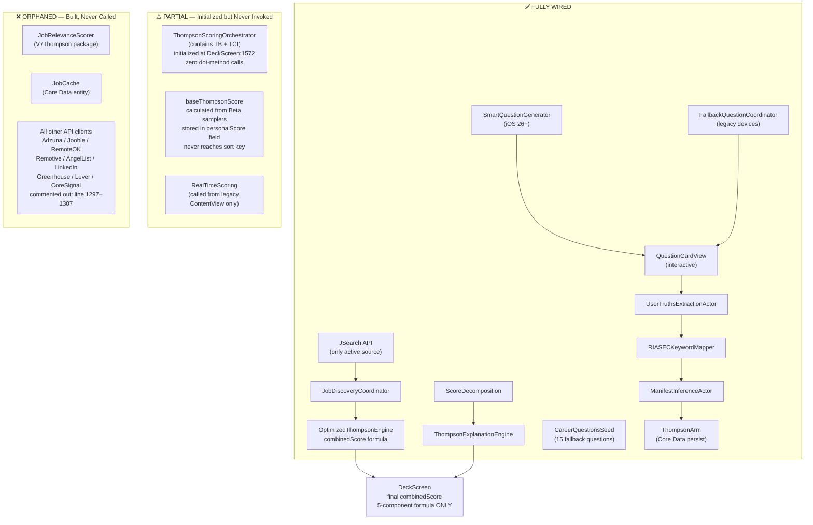

# SCHEMATIC 05 — Connection Status
**Manifest & Match V8 | Generated: 2026-05-14**
**Sources:** `V7Thompson`, `V7AI`, `V7Career`, `V7Services`, `V7UI`, `V7Data`

---

## System Map — Wired vs. Orphaned



---

## Full Audit Table

| Component | Status | File | Evidence |
|---|---|---|---|
| **JSearchAPIClient** | ✅ WIRED | `V7Services/.../JSearchAPIClient.swift` | Primary active source. Registered in JobDiscoveryCoordinator. Called from coordinator.fetchJobs(). Returns jobs to deck. |
| **JobDiscoveryCoordinator** | ✅ WIRED | `V7Services/.../JobDiscoveryCoordinator.swift` | Instantiated in DeckScreen. loadInitialJobs() called on view appear. |
| **OptimizedThompsonEngine** | ✅ WIRED | `V7Thompson/.../OptimizedThompsonEngine.swift` | scoreJobs() called from coordinator. combinedScore reaches JobCardView. |
| **ThompsonArm (Core Data)** | ✅ WIRED | `V7Data/...ThompsonArm+CoreData.swift` | alpha/beta written on every swipe via processInteraction(). Read on engine init. Persists across sessions. |
| **ThompsonBridge** | ⚠️ PARTIAL | `V7AI/.../ThompsonBridge.swift` | ✅ Instantiated inside ThompsonScoringOrchestrator (DeckScreen:2875). ❌ ThompsonScoringOrchestrator is NEVER invoked — zero `scoringOrchestrator.` method calls in entire DeckScreen.swift. `applyUserTruthsBonusToUpcomingJobs()` (line 1481) logs "ready" and returns empty. Code comment "Sprint 4 COMPLETE" is aspirational, not factual. UserTruths bonuses do NOT reach the final combinedScore. |
| **ThompsonCareerIntegrator** | ⚠️ PARTIAL | `V7Career/.../ThompsonCareerIntegrator.swift` | ✅ Instantiated inside ThompsonScoringOrchestrator (DeckScreen:2879). ❌ Same as ThompsonBridge — the orchestrator is never called. Career goal bonuses do NOT reach the final combinedScore. |
| **SmartQuestionGenerator** | ✅ WIRED | `V7AI/.../SmartQuestionGenerator.swift` | Instantiated as @State in DeckScreen:134. generateNextQuestion() called at DeckScreen:1789. Questions added to deck as CardItem.question. iOS 26+ Foundation Models path. |
| **FallbackQuestionCoordinator** | ✅ WIRED | `V7AI/.../FallbackQuestionCoordinator.swift` | Called on devices pre-iOS 26. Serves FallbackCareerQuestion entities seeded by CareerQuestionsSeed. |
| **QuestionCardView** | ✅ WIRED | `V7UI/.../QuestionCardView.swift` | Rendered via QuestionCardViewPlaceholder (DeckScreen:530). Interactive — multiple answer types. onAnswer callbacks fire. |
| **UserTruthsExtractionActor** | ✅ WIRED | `V7AI/.../UserTruthsExtractionActor.swift` | Called from DeckScreen:1250 via .shared.extractAndUpdate(). Parses question answers with Foundation Models. Writes to UserTruths Core Data entity. |
| **RIASECKeywordMapper** | ✅ WIRED | `V7AI/.../RIASECKeywordMapper.swift` | Instantiated in AnswerParsingActor and RIASECScorer. extractRIASEC() called on question answers. Output feeds ManifestInferenceActor. |
| **ManifestInferenceActor** | ✅ WIRED | `V7AI/.../ManifestInferenceActor.swift` | Called async from DeckScreen:1005 on every swipe. Debounced 5s. Requires 10+ swipes. Writes InferredManifestProfile. Feedback loop: updates UserProfile.desiredRoles if confidence ≥ 0.30. |
| **ScoreDecomposition** | ✅ WIRED | `V7Thompson/.../ScoreDecomposition.swift` | Created in OptimizedThompsonEngine during scoring. Used by ExplainFitSheet, OverviewTab, SkillsTab, CareerPathTab, JobInsightsDetailView. |
| **ThompsonExplanationEngine** | ✅ WIRED | `V7Thompson/.../ThompsonExplanationEngine.swift` | Instantiated in ThompsonIntegration.swift. explainScore() called to power ExplainFitSheet ("Why?" button on job card). |
| **CareerQuestionsSeed** | ✅ WIRED | `V7Data/.../CareerQuestionsSeed.swift` | seedQuestions() called from FallbackQuestionCoordinator. Seeds 15 career questions into Core Data. Displayed as fallback questions every 5 jobs on legacy devices. |
| **InferredManifestProfile** | ✅ WIRED | `V7Data/...InferredManifestProfile+CoreData.swift` | Written by ManifestInferenceActor. Read by ManifestTabView for career path display. Drives targetRole, RIASEC dims, convergenceError. |
| **ProfileConverter** | ✅ WIRED | `V7Services/.../Utilities/ProfileConverter.swift` | toThompsonProfile() called from DeckScreen:1503 and MainTabView:161. Translates Core Data UserProfile to V7Thompson.UserProfile with weighted skills + RIASEC + workActivities. |
| **RealTimeScoring** | ⚠️ PARTIAL | `V7Thompson/.../RealTimeScoring.swift` | Built with async scoring pipeline. Called from ThompsonScoringBridge.subscribeToRealTimeScoring() in ContentView.swift. ContentView.swift is LEGACY V7 code — not the active V8 flow. DeckScreen does not use it. |
| **baseThompsonScore** | ⚠️ PARTIAL | `OptimizedThompsonEngine.swift:496` | Calculated: `let baseThompsonScore = amberSample × (1−t) + tealSample × t`. Passed to ThompsonBridge as input. ThompsonBridge applies bonus multiplier: `finalScore = baseScore × (1.0 + userTruthsBonus + careerBonus)`. Combined score caps at 0.99. ⚠️ The Beta distribution SAMPLE values affect the base but the 5-component professional score is the dominant signal — the Beta samplers are not driving exploration in the original Thompson Sampling sense. |
| **JobRelevanceScorer** | ❌ ORPHANED | `V7Thompson/.../JobRelevanceScorer.swift` | Declared as public actor with shared singleton. scoreJob() and precomputeScores() methods: zero call sites found. Never instantiated. Output never reaches UI. |
| **JobCache (Core Data)** | ❌ ORPHANED | `V7Data/.../JobCache+CoreData.swift` | Entity defined with cache() static method. NEVER written to — no .cache() calls found. Only referenced in V5→V7 migration code. No actual job caching occurs. |
| **LinkedIn / Greenhouse / Lever / AngelList API clients** | ❌ ORPHANED | `V7Services/.../CompanyAPIs/` | Client files exist. NOT registered in JobSourceIntegrationService. Never instantiated in coordinator flow. 8 of 9 additional sources inactive. |

---

## Scoring Pipeline — What Actually Affects the Score

```
OptimizedThompsonEngine.fastProfessionalScore()
  ↓
baseThompsonScore = amberSample × (1−t) + tealSample × t   [line 496]
  → stored in ThompsonScore.personalScore
  → DOES NOT affect deck ordering

combinedScore = min(1.0,
  titleScore × w_title +
  skillsScore × w_skills +
  locationScore × w_location +
  workActivitiesScore × w_workActivities +
  riasecScore × w_riasec
)                                                           [lines 511–517]
  → stored in ThompsonScore.combinedScore
  → THIS IS THE SORT KEY
  ↓
DeckScreen sort + display

ThompsonScoringOrchestrator (contains ThompsonBridge + ThompsonCareerIntegrator)
  → initialized at DeckScreen:1572
  → NEVER CALLED (zero dot-method invocations)
  → UserTruths bonuses and career bonuses do NOT apply
```

**What drives the professional score (5 components):**

| Component | Driver | Range |
|---|---|---|
| titleScore | UserProfile.desiredRoles (static + inferred) | {0.0, 1.0} |
| skillsScore | resumeSkills (1.0) + onetSkills (0.7) | [0.0, 1.0] |
| locationScore | UserProfile.primaryLocation vs job location | [0.0, 0.10] |
| workActivitiesScore | UserProfile.onetWorkActivities vs job O*NET | [0.0, 1.0] |
| riasecScore | UserProfile.onetRIASEC* vs job Holland code | [0.0, 1.0] |

**What the Beta samplers (amberSampler, tealSampler) actually do:**
- Alpha/beta update on every swipe and persist to ThompsonArm Core Data
- Sampled values feed into baseThompsonScore
- ThompsonBridge uses baseThompsonScore as input before applying bonuses
- The Beta samplers ARE connected — but the professional component weights dominate
- True exploration/exploitation (uncertainty-driven job ordering) is not the primary ranking signal

---

## Counts

| Category | Count | Percentage |
|---|---|---|
| Fully wired | 13 | 57% |
| Partial — initialized, never invoked | 4 | 17% |
| Orphaned — built, never instantiated | 3 | 13% |
| **Total audited** | **20** | — |

**Partial components:** ThompsonBridge, ThompsonCareerIntegrator (both inside un-invoked orchestrator), baseThompsonScore (calculated, not used for sorting), RealTimeScoring (legacy path only)

---

## Orphaned Code — Removal Candidates

| Component | Safe to Remove? | Risk |
|---|---|---|
| `JobRelevanceScorer.swift` | ✅ Yes | Zero callers. No downstream dependencies. |
| `JobCache` Core Data entity | ⚠️ Careful | Referenced in V5→V7 migration code. Check if migration still runs before removing. |
| LinkedIn/Greenhouse/Lever/AngelList clients | ✅ Yes (if no plans) | Not registered. Removal reduces surface area. Keep if future job sources are planned. |
| `RealTimeScoring.swift` | ⚠️ Careful | Called from ContentView.swift (legacy). ContentView.swift itself may need auditing before removal. |

---

## Corrections to Prior Agent Findings (verified against actual code)

**Job sources:** Only JSearch is active. JobDiscoveryCoordinator:1293 is explicit: `// ✅ ONLY JSEARCH ENABLED - All other sources disabled per user request`. All other sources are commented out at lines 1297–1307. The data flow agent's claim of multiple active sources was wrong.

**ThompsonBridge / ThompsonCareerIntegrator:** Both ARE instantiated inside `ThompsonScoringOrchestrator` (DeckScreen:2875, 2879). But `scoringOrchestrator` has zero dot-method calls anywhere in DeckScreen.swift. The orchestrator is initialized and sits unused. The code comment "Sprint 4 COMPLETE: ThompsonScoringOrchestrator integrated in loadInitialJobs and loadMoreJobs" is false — the function body that was supposed to invoke it (`applyUserTruthsBonusToUpcomingJobs`) logs "ready" and returns. Status is PARTIAL, not WIRED.

**baseThompsonScore:** Confirmed discarded from deck ordering. `combinedScore` (5-component professional formula, lines 511–517) is the sort key. `baseThompsonScore` (Beta samplers, line 496) is stored in `personalScore` field of the ThompsonScore struct and goes nowhere. SCHEMATIC_02 was correct.
