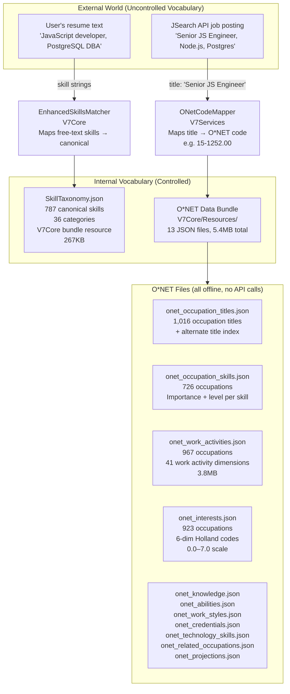

# SCHEMATIC 06 — Taxonomy, O*NET Language, and Fuzzy Matching
**Manifest & Match V8 | Generated: 2026-05-14**
**Source:** Code review — no skills used. Files read directly.

---

## The Core Problem This Layer Solves

A job posting says "Looking for JS devs with Postgres experience."
A user profile says "JavaScript, PostgreSQL."
A naive string match returns 0. This layer makes it return ~0.95.

---

## The Two Vocabularies in Play



---

## O*NET Data Layer — What's Actually Bundled

All O*NET data is **offline, bundled in the app**. No runtime API calls to O*NET.

| File | Occupations | What It Contains | Size |
|---|---|---|---|
| `onet_occupation_titles.json` | 1,016 core | Canonical occupation title per code | 136KB |
| `onet_occupation_alternates_tier1.json` | 2,000 | High-frequency alternate titles (nurse, RN, registered nurse) | — |
| `onet_occupation_alternates_tier2.json` | 3,000 | Medium-frequency alternates | — |
| `onet_modern_mappings.json` | 51 | Curated modern job titles (ML Engineer, DevRel, etc.) | — |
| `onet_keyword_index_tier1.json` | — | Keyword → O*NET code index for fast lookup | — |
| `onet_occupation_skills.json` | **726** | Skills per occupation with importance (0–7) and level (0–7) | 703KB |
| `onet_work_activities.json` | **967** | 41 work activity dimensions per occupation (0–7 importance) | 3.8MB |
| `onet_interests.json` | **923** | 6-dim RIASEC Holland codes per occupation (0–7) | 477KB |
| `onet_work_styles.json` | — | 7 work style dimensions per occupation | — |
| `onet_knowledge.json` | — | Knowledge domains per occupation | — |
| `onet_abilities.json` | — | Ability dimensions per occupation | — |
| `onet_credentials.json` | — | Credentials/certifications per occupation | — |
| `onet_related_occupations.json` | — | Adjacency graph between occupations | — |

**O*NET code format:** `XX-XXXX.XX` (e.g., `15-1252.00` = Software Developer)  
**Source:** U.S. Department of Labor O*NET 27.0 database, embedded at build time.

---

## SkillTaxonomy — The Skills Vocabulary

**File:** `V7Core/Sources/V7Core/Resources/SkillTaxonomy.json` (267KB, 5,868 lines)  
**Loaded by:** `SkillTaxonomyLoader` actor, cached in memory  
**Used by:** `EnhancedSkillsMatcher`

```
787 canonical skills
36 categories
~4.5 aliases per skill average
Total aliases: ~3,500 entries in lookup table
```

### Categories (full list)

| Domain Group | Categories |
|---|---|
| Tech | programming_languages, frameworks, mobile, databases, cloud, devops, ml_ai, web, data, security, testing, design |
| Healthcare | healthcare_clinical, healthcare_specialties, healthcare_imaging, healthcare_therapy, healthcare_it |
| Finance | finance_certifications, finance_analysis, finance_tools |
| Legal | legal_practice, legal_technology, legal_compliance |
| Manufacturing | manufacturing_design, manufacturing_production, manufacturing_automation |
| Education | education_pedagogy, education_technology |
| Business/Marketing | business_operations, marketing_digital, sales_management |
| Other | creative_design, hospitality_food_service, construction_management, agriculture_veterinary, miscellaneous_transferable |

**This is cross-industry.** The taxonomy is not tech-only. A nurse, a lawyer, a construction manager, a hospitality worker — all have recognized canonical skills in this taxonomy.

### Skill Object Structure

```json
{
  "canonical": "JavaScript",
  "aliases": ["JS", "ECMAScript", "ES6", "ES2015"],
  "category": "programming_languages",
  "weight": 1.0,
  "relatedSkills": ["TypeScript", "React", "Node.js"]
}
```

**Weight scale (0.0–1.0):**
- 1.0 = core/primary skill (JavaScript, Python, Swift)
- 0.9 = important supporting skill
- 0.8 = default for unrecognized skills (fallback)
- Lower = peripheral/transferable skill

---

## O*NET Code Mapper — Job Title → O*NET Code

**File:** `V7Services/Sources/V7Services/ONet/ONetCodeMapper.swift`  
**Pattern:** Actor singleton (`ONetCodeMapper.shared`)  
**Called by:** `JobONetEnricher` during job ingestion

### Mapping Pipeline (4 tiers, in order)

```
Input: "Senior iOS Engineer"
  ↓
Step 1: Normalize title
  "senior ios engineer" (lowercase, remove punctuation)
  ↓
Step 2: Exact match cache (O(1))
  1,016 core + 2,000 tier1 alternates + 51 modern = 3,067 entries
  Cache includes all previously fuzzy-matched titles
  ↓ miss
Step 3: Modern mappings lookup (51 curated)
  "ML Engineer", "DevRel", "Platform Engineer", etc.
  ↓ miss
Step 4: Keyword index search (O(log n))
  Prebuilt index: keyword → candidate O*NET codes
  ↓ miss
Step 5: Load Tier 2 alternates (lazy, first miss only)
  3,000 medium-frequency titles
  ↓ miss
Step 6: Fuzzy match fallback (O(n), ~5% of titles)
  Levenshtein distance over all 1,016 core titles
  ↓
Output: MappingResult {
  onetCode: "15-1253.00",
  matchedTitle: "Software Quality Assurance Analysts",
  confidence: 0.87,
  matchType: .fuzzy
}

If confidence < 0.5: return nil (no enrichment)
```

**Coverage claimed:** ~75% Tier 1, ~20% Tier 2, ~5% fuzzy = ~95% total  
**Performance:** <5ms cached, <50ms uncached fuzzy  
**Result cached** in `fuzzyMatchCache` (LRU, 2,000 entries)

---

## Job O*NET Enricher — Wiring Code Mapper to Scoring

**File:** `V7Services/Sources/V7Services/ONet/JobONetEnricher.swift`  
**Pattern:** Actor singleton (`JobONetEnricher.shared`)  
**Called by:** Job ingestion pipeline (after normalize, before score)

```
V7Thompson.Job (title only, no onetCode)
  ↓ JobONetEnricher.enrichJob(job)
  → ONetCodeMapper.mapJobTitle(job.title)
  → Job.onetCode = mapping.onetCode  (if confidence ≥ 0.5)
V7Thompson.Job (with onetCode, ready for scoring)
```

**What onetCode unlocks in scoring:**
- `calculateWorkActivitiesScore()` — fetches 41-dim vector from `onet_work_activities[onetCode]`
- `calculateRIASECScore()` — fetches 6-dim vector from `onet_interests[onetCode]`

**If onetCode is nil (enrichment failed):** Both scores fall back to 0.5 (neutral, no penalty).

---

## EnhancedSkillsMatcher — The Fuzzy Matching Engine

**File:** `V7Core/Sources/V7Core/SkillsMatching/EnhancedSkillsMatcher.swift`  
**Pattern:** `final class`, Sendable, instantiated per engine  
**Taxonomy:** Loaded from `SkillTaxonomy.json` via `SkillTaxonomyLoader`

### The Core Formula

```
EMS(U, J) = Σᵢ [w(uᵢ) × maxMatch(uᵢ, J)] / Σᵢ [w(uᵢ)]

Where:
  U = user weighted skills [{ name, confidence }]
  J = job requirements [String]
  w(uᵢ) = taxonomy.getWeight(canonical(uᵢ)) × skill.confidence
         = taxonomyWeight × (1.0 if resume | 0.7 if O*NET inferred)
  maxMatch(uᵢ, J) = best score across all matching strategies below
```

### 4 Matching Strategies (Priority Order, Early Exit)

```
Strategy 1: EXACT CANONICAL MATCH                     score = 1.0
  canonical(userSkill) == canonical(jobSkill)
  "JS" → "JavaScript" == "JavaScript" ← "JavaScript"  ✓ EXIT

Strategy 2: SYNONYM MATCH (taxonomy lookup)            score = 0.95
  Both aliases resolve to same canonical name
  "Postgres" → "PostgreSQL" == "PostgreSQL" ← "PostgreSQL"  ✓
  (canonicalization handles this — same result as exact)

Strategy 3: SUBSTRING CONTAINMENT                      score = 0.8
  s1.contains(s2) OR s2.contains(s1)  (case-insensitive)
  "iOS" in "iOS Development"  ✓
  "Swift" in "SwiftUI"  ✓

Strategy 4: LEVENSHTEIN FUZZY                          score = similarity × 0.8
  Only if: similarity > threshold (default 0.75)
  similarity = 1 - (levenshteinDistance / max(len(s1), len(s2)))
  "Postgres" ↔ "PostgreSQL": distance=3, max=10, sim=0.7 → below threshold
  (synonym catch in taxonomy catches this before reaching fuzzy)
```

**Performance guardrails:**
- Length pre-filter: if length difference alone makes threshold impossible → skip
- LRU similarity cache: 50,000 entries, keyed on sorted pair
- Batch API: pre-normalizes all unique job skills once before scoring N users

### Configuration Presets

| Config | Exact | Synonym | Substring | Fuzzy Multiplier | Fuzzy Threshold |
|---|---|---|---|---|---|
| `.default` | 1.0 | 0.95 | 0.8 | 0.8 | 0.75 |
| `.strict` | 1.0 | 0.98 | 0.9 | 0.9 | 0.85 |
| `.lenient` | 1.0 | 0.90 | 0.75 | 0.75 | 0.65 |

**What the OptimizedThompsonEngine uses:** `.default` (implied — uses `calculateWeightedMatchScore`)

---

## RIASEC Mapping — Two Completely Different Methods

This is the most important gap in the taxonomy layer.

### Method A: Job RIASEC (from O*NET bundle — GOOD)

```
job.onetCode = "15-1252.00"
  ↓ OptimizedThompsonEngine.calculateRIASECScore()
  → load onet_interests.json["15-1252.00"]
  → {Realistic: 1.5, Investigative: 6.8, Artistic: 3.2,
     Social: 2.1, Enterprising: 3.5, Conventional: 4.2}
  → cosine similarity with UserProfile RIASEC vector
```

This uses **923 occupations of real O*NET data**. The Holland codes for each occupation are from the actual DOL database. As long as `onetCode` was mapped correctly, this is authoritative.

### Method B: User RIASEC from Question Answers (keyword bag — WEAK)

```
User answers question card: "I love analyzing data and building algorithms"
  ↓ RIASECKeywordMapper.extractRIASEC(from: text)
  → tokenize: ["love", "analyzing", "data", "building", "algorithms"]
  → count matches:
     Investigative: "analyze" ✓, "data" ✓, "algorithm" ✓ → count=3
     Realistic: "building" ≈ "build" ✓ → count=1
     Others: 0
  → normalize to 0–7 scale
  → {Investigative: ~6.0, Realistic: ~2.3, others: 0.0}
```

**The keyword sets (total ~90 words across 6 dimensions):**

| Dimension | Sample Keywords |
|---|---|
| Realistic | tools, mechanical, machines, build, fix, repair, hands-on, physical, outdoor, equipment, construction, engineering, technical, craft |
| Investigative | analyze, research, data, scientific, investigate, problem-solving, algorithm, code, programming, developer, engineer, mathematics, statistics, diagnose, evaluate |
| Artistic | creative, design, art, aesthetic, innovative, imagination, expression, visual, writing, music, performance |
| Social | help, teach, counsel, support, care, mentor, collaborate, team, communicate, empathy, service, community, educate |
| Enterprising | lead, manage, direct, persuade, sell, business, negotiate, influence, strategy, executive, compete, ambitious |
| Conventional | organize, detail, accurate, systematic, structured, process, efficient, plan, compliance, quality control, precise, methodical |

**The weakness:** "engineer" and "developer" both appear in Investigative. A mechanical engineer who never codes would score high Investigative from this mapper. A social worker who uses "manage" in their answer accidentally scores Enterprising. The keyword overlap is significant and the vocabulary is thin.

**Impact:** User RIASEC inferred from question answers feeds `InferredManifestProfile` which feeds back into `UserProfile.onetRIASEC*`. If the keyword mapper misfires, the RIASEC scoring becomes noisy — and it drives 5–25% of the final job ranking score.

### Method C: User RIASEC from Onboarding Profile (O*NET lookup — GOOD)

```
User selects current job title in onboarding: "Registered Nurse"
  ↓ ONetCodeMapper.mapJobTitle("Registered Nurse")
  → "29-1141.00"
  ↓ ONetDataService.loadRIASECProfile("29-1141.00")
  → {Social: 6.9, Realistic: 4.2, Investigative: 3.8, ...}
  → Written to UserProfile.onetRIASEC* fields
```

This is also proper O*NET data — same quality as Method A.

---

## The Full O*NET Taxonomy Chain (End to End)

```mermaid
flowchart TD
    JSearch["JSearch API\n'Pediatric ICU Nurse'"] -->|title| JOE["JobONetEnricher\nenrichJob()"]
    JOE -->|mapJobTitle()| ONCM["ONetCodeMapper\nTier1→Tier2→Fuzzy"]
    ONCM -->|"'29-1141.00' conf=0.91"| JOB["V7Thompson.Job\n.onetCode = '29-1141.00'"]

    ONBOARDING["Onboarding\nUser selects 'Software Engineer'"] -->|mapJobTitle| ONCM
    ONCM -->|"'15-1252.00'"| UP["UserProfile\n.onetRIASEC* fields\n.onetWorkActivities"]

    QA["Question Answer\n'I love analyzing data'"] -->|extractRIASEC()| RKM["RIASECKeywordMapper\n~90 keywords\nbag-of-words"]
    RKM -->|dim scores| IMP["InferredManifestProfile\n.riasecInvestigativeDirect/Inferred\nblended into UserProfile"]

    JOB -->|onetCode| WA_FETCH["onet_work_activities.json\n967 occupations\n41-dim vector"]
    JOB -->|onetCode| RIASEC_FETCH["onet_interests.json\n923 occupations\n6-dim Holland codes"]

    UP -->|workActivities vector| COS_WA["Cosine similarity\nworkActivitiesScore"]
    UP -->|riasec vector| COS_R["Cosine similarity\nriasecScore"]

    WA_FETCH --> COS_WA
    RIASEC_FETCH --> COS_R

    COS_WA -->|0–1| COMBINED["combinedScore\n5-component formula"]
    COS_R -->|0–1| COMBINED
```

---

## Skills Path: From Resume to Score

```
User uploads resume PDF
  ↓ V7AIParsing.ResumeParser
  → extracted text → skill strings ["JavaScript", "Postgres", "iOS"]
  → stored as UserProfile.resumeSkills (confidence = 1.0)

User selects job role in onboarding "iOS Developer"
  ↓ ONetCodeMapper → "15-1253.00"
  ↓ onet_occupation_skills["15-1253.00"]
  → top 10 high-importance skills: ["Swift", "Xcode", "UIKit", "Core Data", ...]
  → stored as UserProfile.onetSkills (confidence = 0.7)

Scoring: EnhancedSkillsMatcher.calculateWeightedMatchScore()
  Input: WeightedSkill[]
    - {name: "JavaScript", confidence: 1.0}  ← from resume
    - {name: "Swift",      confidence: 1.0}  ← from resume
    - {name: "UIKit",      confidence: 0.7}  ← from O*NET inference

  Against job requirements: ["JS", "React Native", "SwiftUI"]

  Per skill:
    "JavaScript" → canonical: "JavaScript"
      jobSkill "JS" → canonical: "JavaScript"
      Strategy 1 EXACT MATCH → score 1.0 × weight(1.0) × conf(1.0) = 1.0
    "Swift" → canonical: "Swift"
      "SwiftUI" → canonical: "SwiftUI" — no exact match
      substring: "swift" in "swiftui" ✓ → score 0.8 × weight(1.0) × conf(1.0) = 0.8
    "UIKit" → canonical: "UIKit"
      no match → 0

  skillsScore = (1.0 + 0.8 + 0) / (1.0 + 1.0 + 0.7) = 1.8 / 2.7 = 0.667
```

---

## Work Activities Path: From O*NET to Score

```
UserProfile.onetWorkActivities loaded from:
  currentJobTitle "Software Engineer" → onetCode "15-1252.00"
  → onet_work_activities["15-1252.00"]
  → 41-dim vector e.g.:
     {actId_1: 6.5,  ← "Getting information"
      actId_2: 5.8,  ← "Processing information"
      actId_3: 4.2,  ← "Making decisions"
      ...}

Job: enriched with onetCode "15-1254.00" (Web Developer)
  → onet_work_activities["15-1254.00"]
  → similar 41-dim vector

workActivitiesScore = cosine_similarity(user_vector, job_vector)
  = (u⃗ · j⃗) / (|u⃗| × |j⃗|)

If either onetCode is missing → fallback = 0.5 (neutral)
```

**Why this enables cross-domain discovery:** A nurse and a UX researcher have different titles and different skills but may have similar work activities (gathering information, helping people, making decisions). At Teal mode (workActivities weight = 30%), the nurse gets served the UX researcher role because the work activity vectors are close.

---

## Known Weaknesses

| Component | Weakness | Impact |
|---|---|---|
| **RIASECKeywordMapper** | ~90 keywords, bag-of-words only, no semantics | User RIASEC from question answers is noisy. "Engineer" → Investigative regardless of type. Overlapping keywords cause false signals. |
| **ONetCodeMapper fuzzy** | Only runs on ~5% of titles; fuzzy match is against 1,016 canonical titles, not the full 3,067 | Non-standard job titles (startup-speak, regional variants) may miss |
| **Work activities fallback** | Returns 0.5 if onetCode lookup fails | Swamps the 30% workActivities weight with neutral signal for mis-mapped jobs |
| **RIASEC fallback** | Returns 0.5 if onetCode lookup fails | Same issue at 5–25% weight |
| **SkillTaxonomy coverage** | 787 skills, 36 categories — strong on tech, decent on healthcare/finance/legal, thinner on construction/hospitality/agriculture | Cross-domain discovery works better for knowledge workers than trades |
| **O*NET data freshness** | Bundled at build time, no live updates | New job titles (AI roles, creator economy) not in 2024-era taxonomy |
| **Work activities vector** | 41-dim O*NET standard dimensions — not domain-labeled | Cosine similarity may find spurious matches between very different occupations that happen to share activity patterns |

---

## File Reference

| File | Location |
|---|---|
| EnhancedSkillsMatcher | `V7Core/Sources/V7Core/SkillsMatching/EnhancedSkillsMatcher.swift` |
| SkillTaxonomy struct | `V7Core/Sources/V7Core/SkillsMatching/SkillTaxonomy.swift` |
| StringSimilarity (Levenshtein) | `V7Core/Sources/V7Core/SkillsMatching/StringSimilarity.swift` |
| SkillTaxonomy.json | `V7Core/Sources/V7Core/Resources/SkillTaxonomy.json` |
| ONetCodeMapper | `V7Services/Sources/V7Services/ONet/ONetCodeMapper.swift` |
| JobONetEnricher | `V7Services/Sources/V7Services/ONet/JobONetEnricher.swift` |
| RIASECKeywordMapper | `V7AI/Sources/V7AI/Parsing/RIASECKeywordMapper.swift` |
| O*NET data bundle | `V7Core/Sources/V7Core/Resources/onet_*.json` |
| JobSkillsExtractor | `V7JobParsing/Sources/V7JobParsing/Extractors/JobSkillsExtractor.swift` |
