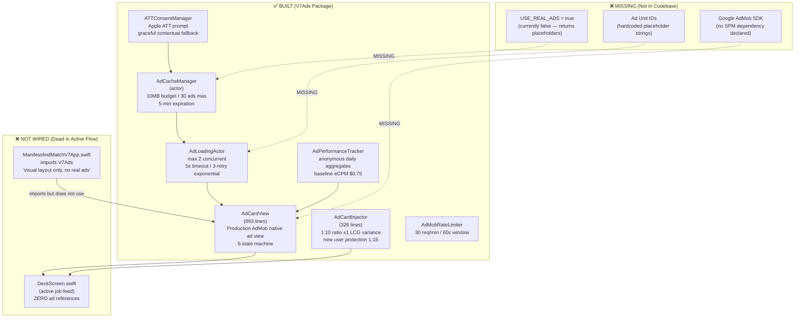

# SCHEMATIC 07 — Advertising System
**Manifest & Match V8 | Generated: 2026-05-14**
**Sources:** `V7Ads`, `ManifestAndMatchV7Feature`, `DeckScreen.swift`, `ManifestAndMatchV7App.swift`

---

## System Map — Built vs. Connected



---

## Full Audit Table

| Component | Status | File | Evidence |
|---|---|---|---|
| **AdCardView** | ✅ BUILT / ❌ NOT WIRED | `V7Ads/Sources/V7Ads/Views/AdCardView.swift:1` | 893 lines. Production-ready AdMob native ad view. 5 states: `.empty`, `.loading`, `.loaded(GADNativeAd)`, `.error(String)`, `.dismissed`. `AdViewModel` using @Observable. 200pt height, 16pt corner radius, teal accent border, SPONSORED badge (8.2:1 contrast), skip button (44pt), CTA button (160×48pt). 1-second impression tracking rule. DeckScreen.swift has zero AdCardView references. |
| **AdCardInjector** | ✅ BUILT / ❌ NOT WIRED | `V7Ads/Sources/V7Ads/Services/AdCardInjector.swift:1` | 326 lines. `AdInjectionConfiguration.standard`: baseRatio=10, variance=1, maxAdsPerSession=20, minimumJobsBetweenAds=10, newUserRatio=15, newUserThreshold=50, firstAdMinimumPosition=5, antiClusteringGap=8. `SeededRandomGenerator` using LCG: a=1664525, c=1013904223, m=2^32. Produces deterministic injection positions. Called from nowhere. |
| **AdCacheManager** | ✅ BUILT / ❌ NOT WIRED | `V7Ads/Sources/V7Ads/Services/AdCachingSystem.swift:1` | Actor. memoryBudget=10MB, maxCachedAds=30, 5-min expiration cleanup timer. `enableRealAds = false` — static feature flag, returns placeholder ad when false (lines 88–92). Never called from app flow. |
| **AdMobRateLimiter** | ✅ BUILT / ❌ NOT WIRED | `V7Ads/Sources/V7Ads/Services/AdCachingSystem.swift` | 30 requests/minute, 60-second window. Integrated inside AdCachingSystem. Dead. |
| **AdLoadingActor** | ✅ BUILT / ❌ NOT WIRED | `V7Ads/Sources/V7Ads/Services/AdCachingSystem.swift` | Max 2 concurrent ad loads, 5-second timeout, 3-retry exponential backoff. Dead. |
| **ATTConsentManager** | ✅ BUILT / ❌ NOT WIRED | `V7Ads/Sources/V7Ads/Services/` | Apple App Tracking Transparency prompt. Graceful degradation to contextual ads if user denies. Contextual = no user data required = valid for privacy-first model. Never called from app flow. |
| **AdPerformanceTracker** | ✅ BUILT / ❌ NOT WIRED | `V7Ads/Sources/V7Ads/Services/AdPerformanceTracker.swift:1` | 406 lines. Anonymous daily aggregate metrics: impressions, clicks, CTR, estimated revenue. `baselineECPM: Decimal = 0.75` (update from AdMob dashboard). Revenue formula: `(impressions / 1000) × eCPM`. 30-day retention. Persists to Documents directory JSON file. No PII. Never called from app flow. |
| **V7Ads Package Import** | ⚠️ PARTIAL | `ManifestAndMatchV7App.swift` | `import V7Ads // Placeholder ad cards (visual layout only, no real ads)`. Package compiles. App target links against it. But ZERO views or services from V7Ads are used in DeckScreen or any active view. Package compiles as dead code. |
| **Google AdMob SDK** | ❌ MISSING | No Package.swift | No SPM dependency for `google-mobile-ads-ios` declared in any Package.swift. The `GADNativeAd` type referenced in AdCardView will fail to compile if `USE_REAL_ADS` flag is enabled without the SDK present. |
| **Ad Unit IDs** | ❌ MISSING | `V7Ads/Sources/V7Ads/` | Placeholder strings throughout. Must be replaced with real AdMob unit IDs from AdMob dashboard before production. |
| **DeckScreen ad injection** | ❌ MISSING | `DeckScreen.swift` | The job feed card loop has no call to `AdCardInjector`. No `CardItem.ad` case exists. Ad cards are never interleaved with job cards. |

---

## AdCardView State Machine

```
AdCardState:
  .empty     → initial state, no request made
  .loading   → GADAdLoader request in flight
  .loaded(GADNativeAd) → ad ready to display
  .error(String) → load failed, show retry or skip
  .dismissed → user tapped skip, collapse card
```

**Display spec:**
- Height: 200pt (vs ~340pt job card)
- Corner radius: 16pt (vs 24pt job card — intentionally smaller)
- Left accent border: teal (matches SacredUI.Colors.teal)
- SPONSORED badge: yellow background, 8.2:1 contrast ratio (WCAG AA pass)
- Skip button: 44pt tap target (Apple HIG minimum)
- CTA button: 160pt wide × 48pt tall

---

## Injection Logic (AdCardInjector)

```
Configuration.standard:
  baseRatio:              10   → 1 ad per 10 jobs
  variance:               1    → actual ratio = 9, 10, or 11 (LCG randomized)
  maxAdsPerSession:       20   → hard cap, no more after session limit
  minimumJobsBetweenAds:  10   → minimum gap, prevents clustering
  newUserRatio:           15   → 1:15 for users with <50 lifetime jobs seen
  newUserThreshold:       50   → above this, standard ratio applies
  firstAdMinimumPosition: 5    → no ad before 5th card
  antiClusteringGap:      8    → if last ad was <8 positions ago, skip insertion

LCG parameters (SeededRandomGenerator):
  a = 1664525
  c = 1013904223
  m = 2^32 (implicit unsigned 32-bit overflow)
```

**Privacy design:** Injection positions are deterministic given seed but appear random to user. No user data is used to target ads (contextual only). ATTConsentManager handles optional behavioral targeting if user consents.

---

## Revenue Model

| Metric | Value | Source |
|---|---|---|
| Baseline eCPM | $0.75 | AdPerformanceTracker.baselineECPM |
| Ad frequency | 1 per 10 jobs | AdInjectionConfiguration.standard |
| Max ads/session | 20 | AdInjectionConfiguration.standard |
| Revenue per 1,000 impressions | $0.75 | eCPM definition |
| Revenue per 10,000 impressions | $7.50 | extrapolated |
| Contextual vs behavioral | Contextual (no ATT required) | ATTConsentManager graceful fallback |

**Note:** $0.75 eCPM is conservative baseline. Contextual ads for professional/career content typically command $2–5 eCPM. Behavioral (post-ATT consent) can reach $8–15 CPM for this demographic. Update `baselineECPM` from the AdMob dashboard after first 1,000 impressions.

---

## What's Missing for Activation

### Step 1: Add AdMob SDK
```swift
// ManifestAndMatchV7Package/Package.swift — add to dependencies:
.package(url: "https://github.com/googleads/swift-package-manager-google-mobile-ads.git",
         from: "11.0.0"),
```
Add to V7Ads target dependency array.

### Step 2: Create AdMob Account + Ad Units
- Register app in AdMob dashboard
- Create Native Ad unit (not Banner, not Interstitial)
- Get Ad Unit ID (format: `ca-app-pub-XXXXXXXX/XXXXXXXX`)
- Replace placeholder strings in V7Ads

### Step 3: Enable Real Ads Flag
```swift
// AdCacheManager — change:
static var enableRealAds = false  // → true for production
```

### Step 4: Wire AdCardInjector into DeckScreen
- Add `CardItem.ad(AdCardView)` case to the card enum
- On job feed load, call `AdCardInjector.injectAds(into: jobList)` 
- Render `AdCardView` when card type is `.ad`

### Step 5: Call ATTConsentManager on First Launch
```swift
// App entry point — before first ad request:
await ATTConsentManager.shared.requestTrackingPermission()
```

### Step 6: Start AdPerformanceTracker
```swift
// DeckScreen or App init:
AdPerformanceTracker.shared.startSession()
```

---

## Connection Status Summary

| System | Built | Wired | Activated |
|---|---|---|---|
| AdCardView | ✅ | ❌ | ❌ |
| AdCardInjector | ✅ | ❌ | ❌ |
| AdCacheManager | ✅ | ❌ | ❌ |
| ATTConsentManager | ✅ | ❌ | ❌ |
| AdPerformanceTracker | ✅ | ❌ | ❌ |
| AdMob SDK | ❌ | ❌ | ❌ |
| Ad Unit IDs | ❌ | ❌ | ❌ |
| DeckScreen injection | ❌ | ❌ | ❌ |

**Estimated effort to activate:** 2–3 days (SDK integration + unit ID configuration + DeckScreen wiring). The ad rendering, caching, rate limiting, consent, and analytics infrastructure is production-ready. The gap is plumbing, not engineering.
