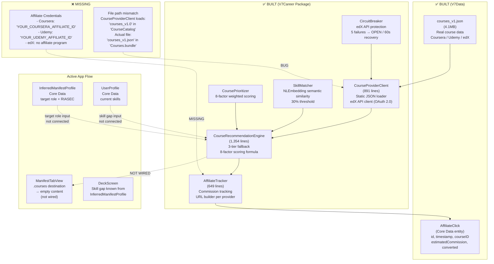

# SCHEMATIC 08 — Course Recommendations & Affiliate Revenue
**Manifest & Match V8 | Generated: 2026-05-14**
**Sources:** `V7Career`, `V7Data`, `ManifestTabView.swift`, `CareerTransitionTests.swift`

---

## System Map — Built vs. Connected



---

## Full Audit Table

| Component | Status | File | Evidence |
|---|---|---|---|
| **CourseRecommendationEngine** | ✅ BUILT / ❌ NOT WIRED | `V7Career/Sources/V7Career/Services/CourseRecommendationEngine.swift:1` | 1,354 lines. `getRecommendations(for: UserProfile, targetRole: String, limit: Int) async` is the main entry point. 3-tier fallback: (1) JSON static DB → (2) edX live API → (3) hardcoded fallback courses. 8-factor `CoursePrioritizer` scoring. Only called from `Testing/CareerTransitionTests.swift`. Zero references in any View or coordinator in the active flow. |
| **CourseProviderClient** | ✅ BUILT / ❌ NOT WIRED | `V7Career/Sources/V7Career/Services/CourseProviderClient.swift:1` | 891 lines. `CourseDatabase` loads `courses_v1.0.json` from `CourseCatalog` resource subdirectory. Actual file is `courses_v1.json` in `Courses.bundle` — **filename/path mismatch will trigger `fatalError` at runtime**. `EdXAPIClient`: baseURL `https://api.edx.org/catalog/v1`, OAuth 2.0, placeholder `clientID`/`clientSecret`. Comment: `// CRITICAL: Must be <10ms for Thompson Sampling` (misplaced — course loading is async, not part of Thompson path). |
| **SkillMatcher** | ✅ BUILT / ❌ NOT WIRED | `V7Career/Sources/V7Career/Services/CourseRecommendationEngine.swift` | Uses `NLEmbedding.wordEmbedding(for: .english)` from NaturalLanguage framework (system, no external dependency). Computes cosine similarity between user skills and course skill tags. 30% threshold for match. Dead — CRE never called. |
| **CoursePrioritizer** | ✅ BUILT / ❌ NOT WIRED | `V7Career/Sources/V7Career/Services/CourseRecommendationEngine.swift` | 8-factor scoring: skillSimilarity(100) + rating(80) + socialProof(50) + difficulty(50) + price(30) + provider(40) + recency(20) + gapPriority(100) = 470 max raw points. Normalizes to 0.0–1.0. Dead. |
| **CircuitBreaker** | ✅ BUILT / ❌ NOT WIRED | `V7Career/Sources/V7Career/Services/CourseProviderClient.swift` | Protects edX API: 5 consecutive failures → OPEN state, 60-second half-open recovery timeout. Prevents cascading failures from unreachable edX endpoint. Dead. |
| **AffiliateTracker** | ✅ BUILT / ❌ NOT WIRED | `V7Career/Sources/V7Career/Services/AffiliateTracker.swift:1` | 649 lines. Commission rates: Coursera=35%, Udemy=17.5%, edX=0% (no affiliate program). `AffiliateURLBuilder.AffiliateCredentials.courseraAffiliateID = "YOUR_COURSERA_AFFILIATE_ID"` — placeholder. Coursera: Rakuten LinkShare format. Udemy: `?referralCode=YOUR_UDEMY_AFFILIATE_ID`. Tracks clicks in UserDefaults (1,000 max) + writes to `AffiliateClick` Core Data entity. Dead. |
| **AffiliateClick (Core Data)** | ✅ BUILT / ❌ NOT WIRED | `V7Data/Sources/V7Data/Entities/AffiliateClick+CoreData.swift:1` | 459 lines. Fields: id(UUID), timestamp, courseID, courseTitle, provider, affiliateURL, converted(Bool), conversionTimestamp(Date?), estimatedCommission(Double), coursePrice(Double). Default `coursePrice = 79.0`. Full validation in `validateForInsert/Update()`. Never written to — AffiliateTracker is never called. |
| **courses_v1.json** | ✅ EXISTS | `Resources/Courses.bundle/courses_v1.json` | 4.1MB of real course data. Confirmed sample: `edx-python-fundamentals-0`, "Python Fundamentals", MIT, rating 4.8. Real data is present. Cannot be loaded due to filename mismatch in CourseProviderClient. |
| **ManifestTabView .courses destination** | ❌ EMPTY | `V7UI/Sources/V7UI/Views/ManifestTabView.swift` | `.courses` tab destination exists in tab navigation. Renders an empty list / placeholder UI. CourseRecommendationEngine is never called. No skill gap input. No course cards display. |
| **Affiliate credentials** | ❌ MISSING | `V7Career/Sources/V7Career/Services/AffiliateTracker.swift` | `courseraAffiliateID = "YOUR_COURSERA_AFFILIATE_ID"`. `udemyReferralCode = "YOUR_UDEMY_AFFILIATE_ID"`. Placeholder strings — no commission will be earned until replaced with real credentials from each affiliate program. |
| **edX affiliate program** | ❌ N/A | `AffiliateTracker.swift` | Commission rate for edX hardcoded to `0.0`. edX does not currently have a public affiliate program (edX was acquired by 2U; program closed). edX courses can be shown but generate no affiliate revenue. |

---

## CourseRecommendationEngine — 3-Tier Fallback

```
Tier 1: Static JSON Database (courses_v1.json)
  → CourseDatabase.loadFromBundle()
  → NLEmbedding skill matching
  → CoursePrioritizer 8-factor score
  → Returns top N results

Tier 2: edX Live API (if Tier 1 returns < threshold results)
  → EdXAPIClient.getCoursesForSkills(skills:)
  → OAuth 2.0 with clientID/clientSecret (PLACEHOLDERS)
  → CircuitBreaker protection (5 failures → OPEN)
  → Results merged with Tier 1

Tier 3: Hardcoded Fallback
  → Static array for: python (Coursera), javascript (Udemy), react (Coursera)
  → Always returns something — prevents empty courses screen
```

---

## CoursePrioritizer — 8-Factor Scoring

| Factor | Weight | Notes |
|---|---|---|
| skillSimilarity | 100 | NLEmbedding cosine similarity vs user skill gap |
| gapPriority | 100 | Is this skill in the user's top 3 gaps? |
| rating | 80 | Course rating (0–5 stars) |
| socialProof | 50 | reviewCount normalized against cohort |
| difficulty | 50 | Match to user's experience level |
| provider | 40 | Coursera > edX > Udemy > other |
| price | 30 | Free scores highest; paid scales inversely |
| recency | 20 | Newer courses preferred |
| **Max raw** | **470** | Normalized to 0.0–1.0 |

---

## Affiliate Revenue Model

| Provider | Commission | Affiliate Program | Status |
|---|---|---|---|
| Coursera | 35% | Rakuten LinkShare | ❌ Credentials missing |
| Udemy | 17.5% | Direct referral code | ❌ Credentials missing |
| edX | 0% | No program (2U acquisition) | N/A |
| LinkedIn Learning | Not configured | Available | Not implemented |

**Revenue math example (Coursera):**
- Course price: $49 (typical Coursera course)
- Commission: 35% = $17.15 per purchase
- If 1% of users who click buy: $17.15 per 100 clicks
- At 500 course views/day: 5 expected purchases × $17.15 = **$85.75/day potential**

**Revenue math example (Udemy):**
- Course price: $14.99 (sale price, common)
- Commission: 17.5% = $2.62 per purchase
- Lower per-purchase but Udemy has higher conversion on sale prices

---

## File Path Mismatch Bug

This is a **silent fatalError** that will crash the app when CourseRecommendationEngine is first called:

```swift
// CourseProviderClient.swift — what the code expects:
private let catalogFileName = "courses_v1.0"
private let resourceSubdirectory = "CourseCatalog"
// → looks for: Courses.bundle/CourseCatalog/courses_v1.0.json

// Actual file on disk:
// Resources/Courses.bundle/courses_v1.json
// (no subdirectory, no .0 in name)

// CourseDatabase.init() will call:
guard let url = Bundle.module.url(forResource: "courses_v1", withExtension: "json",
                                   subdirectory: "Courses.bundle") else {
    fatalError("courses_v1.json not found in Courses.bundle")
}
```

**Fix required before first launch:** Align `CourseProviderClient` constants to match actual bundle path, or move the file to match the expected path.

---

## Skill Gap → Course Recommendation Data Flow (Target)

```
UserProfile (Core Data)
  └─ currentSkills: [String]

InferredManifestProfile (Core Data)
  └─ targetRole: String
  └─ riasecProfile: [String: Double]

ManifestTabView.courses destination:
  1. Fetch UserProfile.currentSkills
  2. Fetch InferredManifestProfile.targetRole
  3. Compute skillGap = targetRoleRequiredSkills − currentSkills
  4. Call CourseRecommendationEngine.getRecommendations(
         for: userProfile,
         targetRole: targetRole,
         limit: 10
     )
  5. Display CourseCard for each result
  6. On tap → AffiliateTracker.recordClick() → open affiliate URL in Safari
  7. AffiliateClick written to Core Data
```

This full data flow exists in pieces. The connections between them are the missing work.

---

## What's Missing for Activation

### Step 1: Fix Filename Mismatch
```swift
// CourseProviderClient.swift — change constants:
private let catalogFileName = "courses_v1"      // was "courses_v1.0"
private let resourceSubdirectory = "Courses.bundle"  // was "CourseCatalog"
```

### Step 2: Register Affiliate Programs
- Apply for Coursera affiliate via Rakuten LinkShare
- Apply for Udemy affiliate at `udemy.com/affiliate`
- Replace placeholder IDs in `AffiliateURLBuilder.AffiliateCredentials`
- Consider LinkedIn Learning affiliate (ShareASale)

### Step 3: Wire ManifestTabView .courses Destination
- Inject `CourseRecommendationEngine.shared` into ManifestTabView
- Fetch `UserProfile` + `InferredManifestProfile` from Core Data
- Call `getRecommendations()` on view appear
- Render results as `CourseCardView` (needs to be created or adapted)

### Step 4: edX API Credentials (Optional — Tier 2)
- Register at edX Partner Portal
- Replace `edxClientID`/`edxClientSecret` placeholders
- Test OAuth 2.0 flow (Tier 1 JSON data is sufficient for launch without this)

### Step 5: Wire AffiliateTracker to Course Taps
```swift
// On course card tap:
AffiliateTracker.shared.recordClick(course: selectedCourse)
UIApplication.shared.open(AffiliateURLBuilder.buildURL(for: selectedCourse))
```

---

## Connection Status Summary

| System | Built | Wired | Activated |
|---|---|---|---|
| CourseRecommendationEngine | ✅ | ❌ | ❌ |
| CourseProviderClient (JSON) | ✅ (bug: filename mismatch) | ❌ | ❌ |
| CourseProviderClient (edX) | ✅ (placeholders) | ❌ | ❌ |
| SkillMatcher (NLEmbedding) | ✅ | ❌ | ❌ |
| CoursePrioritizer | ✅ | ❌ | ❌ |
| CircuitBreaker | ✅ | ❌ | ❌ |
| AffiliateTracker | ✅ | ❌ | ❌ |
| AffiliateClick (Core Data) | ✅ | ❌ | ❌ |
| courses_v1.json (4.1MB) | ✅ | ❌ | ❌ |
| Affiliate credentials | ❌ | ❌ | ❌ |
| ManifestTabView courses view | ❌ | ❌ | ❌ |

**Estimated effort to activate (Phase 1 — static JSON + wiring):** 2–3 days. The course matching logic, scoring, affiliate tracking, and data layer are all built. The gaps are: one filename fix, credential registration (external process, not code), and wiring 3 call sites in ManifestTabView. edX live API and LinkedIn Learning are optional for Phase 2.
